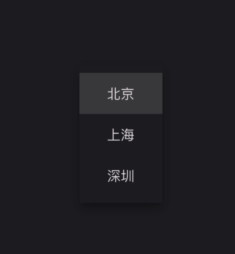

# DropdownButton组件

该组件是一个类似展开一个菜单选择样式的组件,由以下两个组件组合使用

* DropdownButton
* DropdownMenuItem

```dart
class _MyHomePageState extends State<MyHomePage> {
  String currentHome = "北京";

  @override
  Widget build(BuildContext context) {
    return Scaffold(
        appBar: AppBar(title: const Text("title")),
        body: Center(
          child: DropdownButton(
            value: currentHome,
            items: const [
              DropdownMenuItem(
                alignment: Alignment.center,
                value: "北京",
                child: Text("北京"),
              ),
              DropdownMenuItem(
                alignment: Alignment.center,
                value: "上海",
                child: Text("上海"),
              ),
              DropdownMenuItem(
                alignment: Alignment.center,
                value: "深圳",
                child: Text("深圳"),
              ),
            ],
            onChanged: (String? value) {
              setState(() {
                currentHome = value ?? "";
              });
              debugPrint(value);
            },
          ),
        ));
  }
}
```



