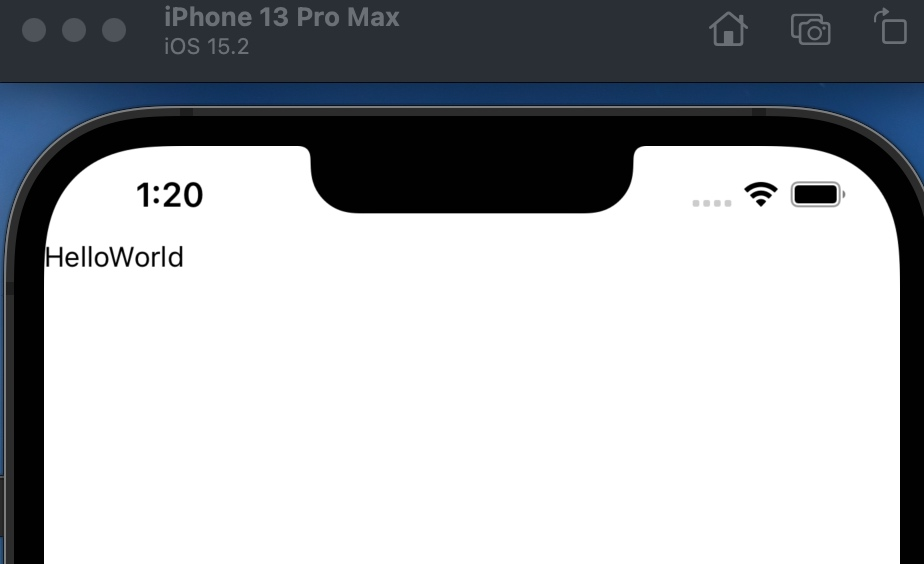
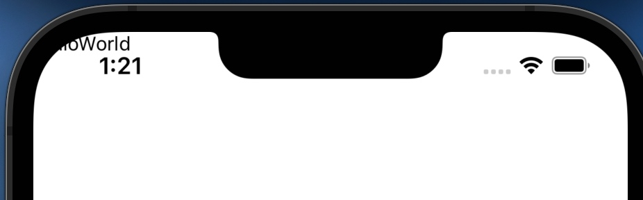
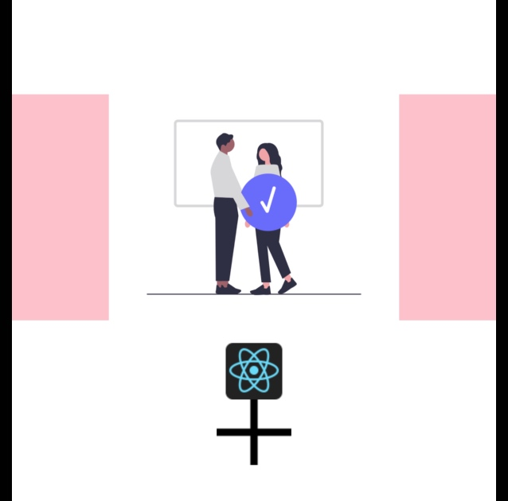
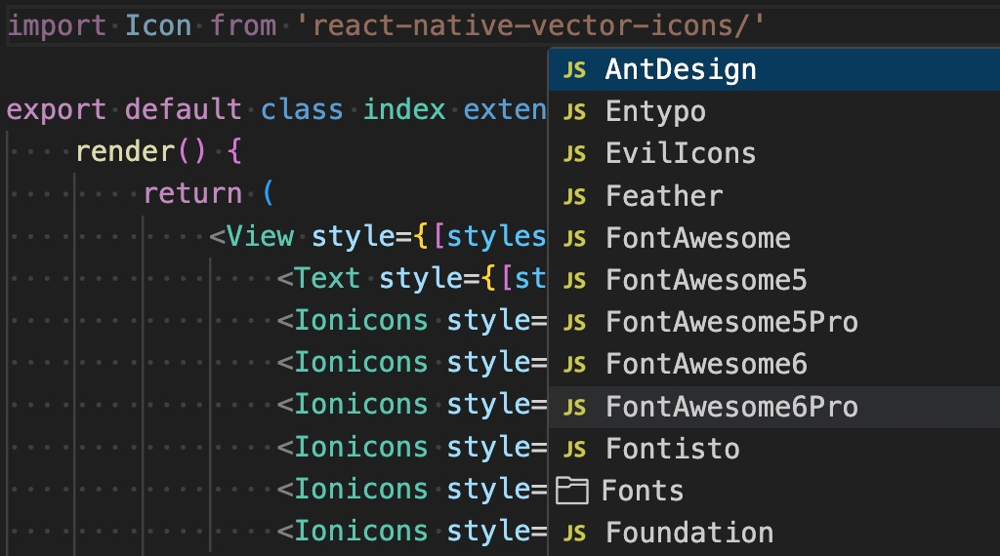
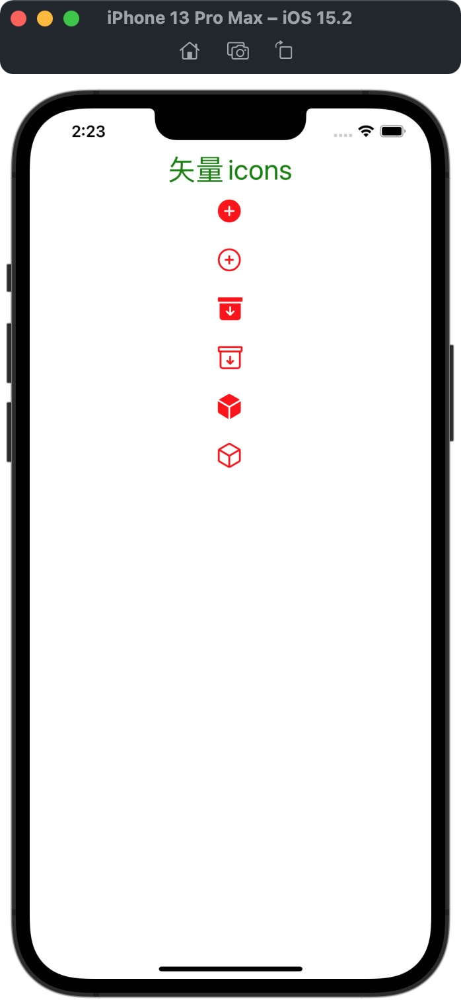

# React Native 组件学习

## SafeAreaView

RN中的SafeAreaView组件用于确保应用程序的内容在屏幕上显示时不会被设备的安全区域所遮挡。安全区域是指屏幕上不受物理限制的区域，例如刘海屏、圆角屏或底部的虚拟导航栏。

```js
import { Text, View, SafeAreaView } from 'react-native'
import React, { Component } from 'react'

export default class App extends Component {
    render() {
        return (
            <SafeAreaView style={{ flex: 1}} forceInset={{ top: 'never'}}>
                <Text>HelloWorld</Text>
            </SafeAreaView>
        )
    }
}
```
* SafeAreaView组件被使用来确保其子组件在屏幕上显示时不会被设备的安全区域所遮挡。

* style={{ flex: 1 }}指定了SafeAreaView组件的样式，其中flex: 1表示SafeAreaView会占据其容器的全部可用空间。

* forceInset={{ top: 'never' }}用于指定在布局时不要强制将内容顶部与设备的安全区域保持一定距离。




> 使用SafeAreaView



> 未使用安全区


## Image

图片组件

```js
import { Text, StyleSheet, View, Image, Dimensions } from 'react-native'
import React, { Component } from 'react'

export default class index extends Component {
    render() {
        return (
            <View style={styles.container}>
                {/* 加载本地图片 */}
                <Image
                    style={[styles.ItemImage]}
                    source={require('./images/TeamEffort.png')}
                />
                {/* 添加网络图片 */}
                <Image
                    style={styles.tinyLogo}
                    source={{
                        uri: 'https://reactnative.dev/img/tiny_logo.png',
                    }}
                />
                {/* 添加base64图片 */}
                <Image
                    style={styles.logo}
                    source={{
                        uri: 'data:image/png;base64,iVBORw0KGgoAAAANSUhEUgAAADMAAAAzCAYAAAA6oTAqAAAAEXRFWHRTb2Z0d2FyZQBwbmdjcnVzaEB1SfMAAABQSURBVGje7dSxCQBACARB+2/ab8BEeQNhFi6WSYzYLYudDQYGBgYGBgYGBgYGBgYGBgZmcvDqYGBgmhivGQYGBgYGBgYGBgYGBgYGBgbmQw+P/eMrC5UTVAAAAABJRU5ErkJggg==',
                    }}
                />
            </View>
        )
    }
}

const styles = StyleSheet.create({
    container: {
        flex: 1,
        justifyContent: 'center',
        alignItems: 'center'
    },
    ItemImage: {
        height: 200,
        width: Dimensions.get('window').width,
        marginVertical: 20,
        resizeMode: 'contain',
        backgroundColor: 'pink'
    },
    tinyLogo: {
        width: 50,
        height: 50,
    },
    logo: {
        width: 66,
        height: 58,
    },
})
```




## TextInput

输入框组件

```js
import { StyleSheet, Text, View, TextInput, Dimensions, Button } from 'react-native'
import React, { Component } from 'react'

export default class index extends Component {

    constructor() {
        super()

        this.state = {
            username: '',
            password: '',
            phoneNum: '',
            userinfo: ''
        }
    }

    doLogin = () => {
        alert(this.state.username)
    }

    render() {
        return (
            <View style={[styles.container]}>
                <TextInput
                    style={[styles.input]}
                    placeholder='请输入用户名'
                    value={this.state.username}
                    onChangeText={(val) => {
                        this.setState({
                            username: val
                        })
                    }}
                />
                <TextInput
                    style={[styles.input]}
                    placeholder='请输入密码'
                    secureTextEntry={true}
                    value={this.state.password}
                    onChangeText={(val) => {
                        this.setState({
                            password: val
                        })
                    }}
                />
                <TextInput
                    style={[styles.input]}
                    placeholder='手机号'
                    keyboardType='number-pad'
                    value={this.state.phoneNum}
                    onChangeText={(val) => {
                        this.setState({
                            phoneNum: val
                        })
                    }}
                />
                <TextInput
                    style={[styles.input]}
                    placeholder='自我介绍'
                    multiline={true}
                    numberOfLines={5}
                    value={this.state.userinfo}
                    onChangeText={(val) => {
                        this.setState({
                            userinfo: val
                        })
                    }}
                />

                <View>
                    <Button
                        title='登录'
                        onPress={this.doLogin}
                        style={[styles.btn]}
                    />
                </View>
            </View>
        )
    }
}

const styles = StyleSheet.create({
    container: {
        flex: 1,
        justifyContent: 'center',
        alignItems: 'center'
    },
    input: {
        width: Dimensions.get('window').width - 20,
        height: 44,
        margin: 10,
        borderWidth: 1,
        borderColor: 'red',
        paddingHorizontal: 5,
        textAlignVertical: 'top'
    },
    btn: {
        margin: 10
    }
})

```

## Touchable

触碰组件

```js
import {
    Text,
    StyleSheet,
    View,
    TouchableHighlight,
    TouchableOpacity,
    TouchableWithoutFeedback,
} from 'react-native'
import React, { Component } from 'react'

export default class index extends Component {
    render() {
        return (
            <View style={[styles.container]}>
                {/* 触碰高亮 */}
                <TouchableHighlight
                    onPress={() => {
                        console.log('触碰高亮')
                    }}
                >
                    <View style={[styles.item]}>
                        <Text>触碰高亮</Text>
                    </View>
                </TouchableHighlight>

                {/* 触碰透明度 */}
                <TouchableOpacity
                    onPress={() => {
                        console.log('触碰透明度')
                    }}
                >
                    <View style={[styles.item]}>
                        <Text>触碰透明度</Text>
                    </View>
                </TouchableOpacity>

                {/* 触碰无响应 */}
                <TouchableWithoutFeedback
                    onPress={() => {
                        console.log('触碰无响应')
                    }}
                >
                    <View style={[styles.item]}>
                        <Text>触碰无响应</Text>
                    </View>
                </TouchableWithoutFeedback>

            </View>
        )
    }
}

const styles = StyleSheet.create({
    container: {
        flex: 1,
        justifyContent: 'center',
        alignItems: 'center'
    },
    item: {
        marginBottom: 20,
        padding: 10,
        borderWidth: 2,
        borderColor: 'red'
    }
})
```


## ScrollView

滚动视图组件

```js
import { Text, StyleSheet, View, ScrollView } from 'react-native'
import React, { Component } from 'react'

export default class index extends Component {
    render() {
        return (
            <View>
                {/* 导航栏 */}
                <ScrollView
                    style={[styles.topNav]}
                    // 横向滚动开关
                    horizontal={true}
                    // 是否显示横向滚动条
                    showsHorizontalScrollIndicator={false}
                >
                    <Text style={[styles.navLabel]}>新闻</Text>
                    <Text style={[styles.navLabel]}>娱乐</Text>
                    <Text style={[styles.navLabel]}>体育</Text>
                    <Text style={[styles.navLabel]}>财经</Text>
                    <Text style={[styles.navLabel]}>军事</Text>
                    <Text style={[styles.navLabel]}>时尚</Text>
                    <Text style={[styles.navLabel]}>科技</Text>

                </ScrollView>

                {/* 文本内容 */}
                <ScrollView
                    style={[styles.scrollView]}
                    // 内容的额外样式效果, 区别与直接修改scroolView的样式
                    contentContainerStyle={{ margin: 30 }}
                    // 是否显示垂直滚动条
                    showsVerticalScrollIndicator={false}
                >
                    <Text style={[styles.text]}>诗来源于上古人类的原始宗教、神话及口传文学、劳动号子和民歌。古时很多诗是可以歌唱的，诗常和音乐、舞蹈结合在一起，因此亦称为“诗歌”。
                        最早有纪载的诗歌是公元前2150年的《吉尔伽美什》。印度的《吠陀》(1700-1200 BC) 。欧洲在古希腊时期开始有诗歌，著名的诗人有荷马、萨福和平达等。古罗马时间著名的诗人有卡图鲁斯、维尔吉和贺拉斯等。一些长篇的诗歌描述了历史和神话故事，又称为史诗。亚里士多德的《诗学》开始对诗作出论述，其著作对后来欧洲和中东的诗歌都有影响。中世纪时基督教的仪式中常常会吟诵圣诗，民间亦常常有游吟诗人到处唱诵诗歌。文艺复兴时期英国有著名诗人和剧作家莎士比亚(1564-1616)创作了不少十四行诗，在他的戏剧中也有不少诗歌。之后产生了抒情诗、田园诗等类型，直到二十世纪中期，现代诗的定义转为宽松，即以语言作的基本创作。近代更有数字诗兴起。现在诗常常发表于专门杂志（如西方最古老的《诗》与《牛津诗歌》）、个人作品集、众作家诗选集、与英美诗歌翻译选辑[1][永久失效链接]等。</Text>
                    {/* 解决滚动不到底部的问题 */}
                    <View style={{ height: 100 }}></View>

                </ScrollView>

            </View>
        )
    }
}

const styles = StyleSheet.create({
    scrollView: {
        backgroundColor: 'pink',
        marginHorizontal: 30,
    },
    text: {
        fontSize: 30,
    },
    navLabel: {
        margin: 10,
        height: 50,
        fontSize: 30
    },
    topNav: {
        backgroundColor: '#dfb'
    }
})
```

## SectionList

类似iOS中带section的TableView

```js
import { Text, StyleSheet, View, SectionList, StatusBar, SafeAreaView } from 'react-native'
import React, { Component } from 'react'


const DATA = [
    {
        title: 'Main dishes',
        data: ['Pizza', 'Burger', 'Risotto'],
    },
    {
        title: 'Sides',
        data: ['French Fries', 'Onion Rings', 'Fried Shrimps'],
    },
    {
        title: 'Drinks',
        data: ['Water', 'Coke', 'Beer'],
    },
    {
        title: 'Desserts',
        data: ['Cheese Cake', 'Ice Cream'],
    },
];


export default class index extends Component {

    constructor() {
        super()

        this.state = {
            isFresh: false
        }
    }
    /// 下拉刷新
    loadData = () => {
        // 开启加载
        this.setState({
            isFresh: true
        })
        // 模拟请求数据
        setTimeout(() => {
            this.setState({
                isFresh: false
            })
            console.log('下拉刷新')
        }, 2000);
    }

    /// 上拉加载更多
    endReached = () => {
        console.log('上拉加载')
    }

    render() {
        return (
            <SafeAreaView style={styles.container}>
                <SectionList
                    style={[styles.section]}
                    sections={DATA}
                    keyExtractor={(item, index) => item + index}
                    renderItem={({ item }) => (
                        <View style={styles.item}>
                            <Text style={styles.title}>{item}</Text>
                        </View>
                    )}
                    renderSectionHeader={({ section: { title } }) => (
                        <Text style={styles.header}>{title}</Text>
                    )}
                    ItemSeparatorComponent={() => {
                        // 声明item之间的分隔符
                        return <View style={{ borderWidth: 1, borderColor: 'red' }}></View>
                    }}
                    ListEmptyComponent={() => {
                        // 列表数据为空时展示的组件
                        return <Text style={[styles.emptyLabel]}>还没有任何数据!</Text>
                    }}
                    // 下拉刷新
                    refreshing={this.state.isFresh}
                    onRefresh={this.loadData}

                    // 上拉加载更多
                    // 0.1表示距离到底部还有10%的距离时触发
                    onEndReachedThreshold={0.1}
                    onEndReached={this.endReached}

                    // HeaderView
                    ListHeaderComponent={() => {
                        return <Text style={{ fontSize: 30 }}>我是一个Header</Text>
                    }}

                    // FooterView
                    ListFooterComponent={() => {
                        return <Text style={{ fontSize: 30 }}>我是一个Footer</Text>
                    }}
                />
            </SafeAreaView>
        )
    }
}

const styles = StyleSheet.create({
    container: {
        flex: 1,
        paddingTop: StatusBar.currentHeight,
    },
    section: {
        paddingHorizontal: 16
    },
    item: {
        backgroundColor: '#f9c2ff',
        padding: 20,
        marginVertical: 8,
    },
    header: {
        fontSize: 32,
        backgroundColor: '#fff',
    },
    title: {
        fontSize: 24,
    },
    emptyLabel: {
        fontSize: 30,
    }
})
```

## FlatList

就是一个简单的ListView, 一层

```js
import { Text, StyleSheet, View, FlatList, TouchableOpacity } from 'react-native'
import React, { Component } from 'react'

export default class index extends Component {
    constructor() {
        super()
        this.state = {
            // 是否在刷新
            isLoading: false,
            // 选择id
            selectedId: '1',
            // 模拟数据
            list: [
                {
                    id: '1',
                    title: '头条'
                },
                {
                    id: '2',
                    title: '娱乐'
                },
                {
                    id: '3',
                    title: '体育'
                },
                {
                    id: '4',
                    title: '军事'
                },
                {
                    id: '5',
                    title: '科技'
                },
                {
                    id: '6',
                    title: '财经'
                },
                {
                    id: '7',
                    title: '时尚'
                },
                {
                    id: '8',
                    title: '社会'
                },
            ]
        }
    }

    // item布局
    renderItem = ({ index, item }) => {
        const backgroundColor = item.id === this.state.selectedId ? '#00f0ff' : 'pink'
        return (
            <TouchableOpacity
                onPress={() => {
                    this.setState({
                        selectedId: item.id
                    })
                }}
                style={[styles.item, { backgroundColor }]}
            >
                <Text style={[styles.title]}>{item.title}</Text>
            </TouchableOpacity>
        )
    }

/// 下拉刷新
    loadData = () => {
        this.setState({
            isLoading: true
        })

        setTimeout(() => {
            console.log('请求数据')
            this.setState({
                isLoading: false,
            })
        }, 2000)

    }

    render() {
        return (
            <View>
                <FlatList
                    data={this.state.list}
                    renderItem={this.renderItem}
                    keyExtractor={item => item.id}

                    // 是否横向滑动
                    horizontal={false}
                    // 初始化显示的下标item置顶
                    initialScrollIndex={0}
                    // 初始渲染item的数量,lazyLoad
                    initialNumToRender={4}
                    // 列数
                    numColumns={1}
                    // 倒置
                    inverted={false}

                    extraData={this.state.selectedId}

                    ItemSeparatorComponent={() => {
                        return <View style={[styles.itemSeporator]}></View>
                    }}
                    ListEmptyComponent={() => {
                        return <Text style={{ fontSize: 30 }}>没有任何数据</Text>
                    }}
                    // 下拉刷新
                    refreshing={this.state.isLoading}
                    onRefresh={this.loadData}

                    // 上拉加载
                    onEndReachedThreshold={0.1}
                    onEndReached={() => {
                        console.log('到底部')
                    }}

                    // header
                    ListHeaderComponent={() => {
                        return <Text style={[styles.header]}>HeaderView</Text>
                    }}
                    // footer
                    ListFooterComponent={() => {
                        return <Text style={[styles.footer]}>没有更多了</Text>
                    }}

                >

                </FlatList>
            </View>
        )
    }
}

const styles = StyleSheet.create({
    item: {
        margin: 10,
        height: 100,
        backgroundColor: 'pink',
        justifyContent: 'center'
    },
    title: {
        fontSize: 30,
        margin: 10
    },
    itemSeporator: {
        borderWidth: 1,
        borderColor: 'red',
        marginHorizontal: 10
    },
    header: {
        fontSize: 30,
        margin: 10
    },
    footer: {
        fontSize: 16,
        justifyContent: 'center',
        alignItems: 'center',
        margin: 10
    }
})
```

## Animated

```js
import React, { useEffect, useLayoutEffect, useRef } from 'react';
import {
    Animated,
    Text,
    View,
    StyleSheet,
    Button,
    SafeAreaView,
} from 'react-native';

const App = () => {
    // fadeAnim will be used as the value for opacity. Initial Value: 0
    const fadeAnim = useRef(new Animated.Value(0)).current;
    moveAnim = useRef(new Animated.Value(0)).current;

    const fadeIn = () => {
        scanMove()
        // Will change fadeAnim value to 1 in 5 seconds
        Animated.timing(fadeAnim, {
            toValue: 1,// 目标值
            duration: 500,// 间隔时间
            useNativeDriver: true,// 启动原生方式,渲染动画(执行效率高)
        }).start(() => {
            console.log('显示完成')
        });
    };

    const fadeOut = () => {
        // Will change fadeAnim value to 0 in 3 seconds
        Animated.timing(fadeAnim, {
            toValue: 0,
            duration: 300,
            useNativeDriver: true,
        }).start();
    };

    scanMove = () => {
        moveAnim.setValue(0)
        Animated.timing(this.moveAnim, {
            toValue: 200,
            duration: 2000,
            useNativeDriver: true
        }).start(() => {
            scanMove()
        })
    }

    // // 组件加载后执行一次
    // useEffect(() => {
    //     scanMove()
    // }, [])

    return (
        <SafeAreaView style={styles.container}>
            <Animated.View
                style={[
                    styles.fadingContainer,
                    {
                        // Bind opacity to animated value
                        opacity: fadeAnim,
                    },
                ]}>
                <Text style={styles.fadingText}>Fading View!</Text>
            </Animated.View>
            <View style={styles.buttonRow}>
                <Button title="Fade In View" onPress={fadeIn} />
                <Button title="Fade Out View" onPress={fadeOut} />
            </View>

            <View style={[styles.scanView]}>
                <Animated.View
                    style={[
                        styles.border,
                        {
                            transform: [{
                                translateY: moveAnim
                            }]
                        },
                    ]}>
                </Animated.View>

            </View>
        </SafeAreaView>
    );
};

const styles = StyleSheet.create({
    container: {
        flex: 1,
        alignItems: 'center',
        justifyContent: 'center',
    },
    fadingContainer: {
        padding: 20,
        backgroundColor: 'powderblue',
    },
    fadingText: {
        fontSize: 28,
    },
    buttonRow: {
        flexBasis: 100,
        justifyContent: 'space-evenly',
        marginVertical: 16,
    },
    scanView: {
        height: 200,
        width: 200,
        borderWidth: 1,
        borderColor: 'green'
    },
    border: {
        borderWidth: 1,
        borderColor: 'red'
    }
});

export default App;
```

## WebView

第三方库

### 安装

```shell
npm install --save react-native-webview
```
### 使用

```js
import { Text, StyleSheet, View } from 'react-native'
import React, { Component } from 'react'
import { WebView } from 'react-native-webview';

export default class index extends Component {
    render() {
        return (
            // 加载网页
            // <WebView source={{ uri: 'https://m.sogou.com' }} style={{ flex: 1 }} />
            // 加载HTML代码
            <WebView source={{ html: "<h1 style='color: red'>Hello World</h1>" }} style={{ flex: 1 }} />
        )
    }
}

const styles = StyleSheet.create({})
```

## Picker

https://github.com/react-native-picker/picker

### 安装

```shell
npm install @react-native-picker/picker --save
```

### 使用

```js
import { Text, StyleSheet, View } from 'react-native'
import React, { Component } from 'react'
// 导入头文件
import { Picker } from '@react-native-picker/picker'

export default class index extends Component {

    constructor() {
        super()
        // 创建color属性
        this.state = {
            color: 'white'
        }
    }

    render() {
        return (
            // 追加背景颜色样式,读取选中的颜色值
            <View style={[styles.container, { backgroundColor: this.state.color }]}>
                <Text style={[styles.textLabel]}>{this.state.color}</Text>
                <Picker
                    style={[styles.picker]}
                    // 制定选择的值
                    selectedValue={this.state.color}
                    // 回调事件
                    onValueChange={(itemValue, itemIndex) =>
                        this.setState({
                            color: itemValue
                        })
                    }>
                    {/* 创建Picker元素 */}
                    <Picker.Item label="白色" value="white" />
                    <Picker.Item label="红色" value="red" />
                    <Picker.Item label="绿色" value="green" />
                    <Picker.Item label="黄色" value="yellow" />
                    <Picker.Item label="蓝色" value="blue" />
                    <Picker.Item label="粉色" value="pink" />
                    <Picker.Item label="紫色" value="purple" />
                </Picker>
            </View>
        )
    }
}

const styles = StyleSheet.create({
    container: {
        flex: 1,
        justifyContent: 'center',
    },
    picker: {
        backgroundColor: '#dfb'
    },
    textLabel: {
        textAlign: 'center',
        fontSize: 30
    }
})
```

## Swiper

https://github.com/leecade/react-native-swiper

### 安装

```shell
npm i react-native-swiper --save
```

### 使用 

```js
import { Text, StyleSheet, View, ScrollView } from 'react-native'
import React, { Component } from 'react'
import Swiper from 'react-native-swiper'

export default class index extends Component {
    render() {
        return (
            <ScrollView>
                <Swiper
                    style={styles.wrapper}
                    // 是否显示左右箭头按钮
                    showsButtons={false}
                    // 是否自动轮播
                    autoplay={false}
                    // 自动轮播的间隔
                    autoplayTimeout={3.5}
                    // 是否显示底部的提示(小圆点)
                    showsPagination={true}
                    // 是否循环(关闭循环后,播放到最后一个不会继续)
                    loop={false}
                    // false是反着滚动
                    autoplayDirection={false}
                    // 奇怪用着有点问题,滑动都滑不了
                    horizontal={true}
                    // index改变时回调
                    onIndexChanged={(index) => {
                        console.log(index)
                    }}
                    // 下一个/上一个按钮的自定义样式,<必须>showsButtons={true}
                    nextButton={<Text>next</Text>}
                    prevButton={<Text>prev</Text>}
                    // 是否想iOS那种到边缘时滑动带弹性效果
                    bounces={true}
                    // 类似iOS paging效果,滑动时,是否保持整页效果
                    pagingEnabled={true}
                >
                    <View style={styles.slide1}>
                        <Text style={styles.text}>Hello Swiper</Text>
                    </View>
                    <View style={styles.slide2}>
                        <Text style={styles.text}>Beautiful</Text>
                    </View>
                    <View style={styles.slide3}>
                        <Text style={styles.text}>And simple</Text>
                    </View>
                </Swiper>
            </ScrollView>
        )
    }
}

const styles = StyleSheet.create({
    wrapper: {
        height: 200
    },
    slide1: {
        flex: 1,
        justifyContent: 'center',
        alignItems: 'center',
        backgroundColor: '#9DD6EB'
    },
    slide2: {
        flex: 1,
        justifyContent: 'center',
        alignItems: 'center',
        backgroundColor: '#97CAE5'
    },
    slide3: {
        flex: 1,
        justifyContent: 'center',
        alignItems: 'center',
        backgroundColor: '#92BBD9'
    },
    text: {
        color: '#fff',
        fontSize: 30,
        fontWeight: 'bold'
    }
})
```

## AsyncStorage 

https://react-native-async-storage.github.io/async-storage/docs/install

## 安装

```shell
npm install @react-native-async-storage/async-storage
```
## 封装

```js
import AsyncStroage from '@react-native-async-storage/async-storage'


class Storage {
    /**
     * 增
     * @param {string} key 
     * @param {mixed} value 
     * @returns {Promise}
     */
    static set(key, value) {
        return AsyncStroage.setItem(key, JSON.stringify(value))
    }

    /**
     * 查
     * @param {string} key 
     * @returns {Promise}
     */
    static get(key) {
        return AsyncStroage.getItem(key).then(value => {
            if (value && value !== '') {
                const jsonValue = JSON.parse(value)
                return jsonValue
            }
        }).catch(() => null)
    }

    /**
     * 改
     * @param {string} key 
     * @param {mixed} newValue 
     * @returns {Promise}
     */
    static update(key, newValue) {
        return AsyncStroage.getItem(key).then(oldValue => {
            newValue = typeof newValue === 'string' ? newValue : Object.assign({}, oldValue, newValue)
            return AsyncStroage.setItem(key, JSON.stringify(newValue))
        })
    }

    /**
     * 删
     * @param {string} key 
     * @returns {Promise}
     */
    static delete(key) {
        return AsyncStroage.removeItem(key)
    }

    /**
     * 清空
     */
    static clear() {
        return AsyncStroage.clear()
    }
}

export default Storage
```

## 使用

```js
import { Text, StyleSheet, View, Button } from 'react-native'
import React, { Component } from 'react'
import AsyncStorage from '@react-native-async-storage/async-storage';
import Storage from './storage'


export default class index extends Component {
    // 官方demo 写
    storeData = async (value) => {
        try {
            await AsyncStorage.setItem('my-key', value);
        } catch (e) {
            // saving error
        }
    };
    // 官方demo 读
    getData = async () => {
        try {
            const value = await AsyncStorage.getItem('my-key');
            if (value !== null) {
                // value previously stored
                console.log('读取:' + value)
            }
        } catch (e) {
            // error reading value
        }
    };


    // 自己封装 增
    writeData = async () => {
        try {
            const value = await Storage.set('name', 'Jack')
        } catch (e) {

        }
    }

    // 自己封装 查
    readData = async () => {
        try {
            const value = await Storage.get('name')
            if (value !== null) {
                console.log('查询:' + value)
            }
        } catch (e) {

        }
    }

    // 自己封装 改
    updateData = async () => {
        try {
            const value = await Storage.update('name', 'Tom')
        } catch (e) {

        }
    }

    // 自己封装 删
    deleteData = async () => {
        try {
            const value = await Storage.delete('name')
        } catch (e) {

        }
    }

    render() {
        return (
            <View style={[styles.container]}>
                <Text style={[styles.label]}>AsyncStorage</Text>
                <Button
                    style={[styles.button]}
                    title='Save'
                    onPress={() => {
                        this.storeData('Hello World')
                    }}
                />
                <Button
                    style={[styles.button]}
                    title='Read'
                    onPress={() => {
                        this.getData()
                    }}
                />
                <Button
                    style={[styles.button]}
                    title='增'
                    onPress={() => {
                        this.writeData()
                    }}
                />
                <Button
                    style={[styles.button]}
                    title='删'
                    onPress={() => {
                        this.deleteData()
                    }}
                />
                <Button
                    style={[styles.button]}
                    title='改'
                    onPress={() => {
                        this.updateData()
                    }}
                />
                <Button
                    style={[styles.button]}
                    title='查'
                    onPress={() => {
                        this.readData()
                    }}
                />
                <Button
                    style={[styles.button]}
                    title='清空'
                    onPress={Storage.clear}
                />
            </View>
        )
    }
}

const styles = StyleSheet.create({
    container: {
        flex: 1,
        justifyContent: 'center',
        alignItems: 'center'
    },
    label: {
        fontSize: 30,
        padding: 10
    },
    button: {
        width: 100,
        height: 50
    }
})
```

## Geolocation

https://github.com/michalchudziak/react-native-geolocation

### 安装

```shell
npm install @react-native-community/geolocation --save
```

### 使用

```js
/**
 * 这个expo项目不知道怎么写info.plist
 */

import { Text, StyleSheet, View } from 'react-native'
import React, { Component } from 'react'
import GeoLocation from '@react-native-community/geolocation'


export default class index extends Component {

  componentDidMount() {
    //组件加载时获取地理位置信息,并打印出来
    GeoLocation.getCurrentPosition(info => console.log(info))
  }

  render() {
    return (
      <View>
        <Text>index</Text>
      </View>
    )
  }
}

const styles = StyleSheet.create({})
```

## Navigation

https://reactnavigation.org/docs/getting-started

### 安装

```shell
npm install @react-navigation/native
```

```shell
npx expo install react-native-screens react-native-safe-area-context
```

### 使用

```js
import { Text, View, SafeAreaView } from 'react-native'
import React, { Component } from 'react'
import { NavigationContainer } from '@react-navigation/native';

import ReactView from './src_18_Navigation'

export default class App extends Component {
    render() {
        return (
            <NavigationContainer>
                    <ReactView />
            </NavigationContainer>
        )
    }
}
```

## Stack

需要先安装Navigation,并按上面在App.js中配置好

https://reactnavigation.org/docs/hello-react-navigation

### 安装

```shell
npm install @react-navigation/native-stack
```


### 传递参数

通过将参数放在对象中作为navigation.navigate函数的第二个参数，将参数传递给路线：navigation.navigate('RouteName', { /* params go here */ })

```js
navigation.navigate('Details', {
    itemId: 86,
    otherParam: 'anything you want here',
});
```

### route打印

`{"key": "Details-oKCqKk6ZioLJL2cNlzeab", "name": "Details", "params": {"itemId": 86, "otherParam": "anything you want here"}, "path": undefined}`

### 获取参数

`const { itemId, otherParam } = route.params;`

### 使用

```js
import { Text, StyleSheet, View, Button, TouchableOpacity } from 'react-native'
import React, { Component } from 'react'
import { createNativeStackNavigator } from '@react-navigation/native-stack'


function HomeScreen(prop) {
    return (
        <View style={[styles.container]}>
            <Text style={[styles.text]}>Home Screen</Text>
            <Button
                title={'go to detail'}
                onPress={() => {
                    prop.navigation.navigate('Detail')
                }}
            />
        </View>
    )
}

function DetailScreen(prop) {
    return (
        <View style={[styles.container]}>
            <Text style={[styles.text]}>Detail Screen</Text>
            <Button
                title={'go to home'}
                onPress={() => {
                    prop.navigation.navigate('Home')
                }}
            />
        </View>
    )
}


const Stack = createNativeStackNavigator()

export default class index extends Component {
    render() {
        return (
            <Stack.Navigator
                // 定义初始路由页面
                initialRouteName='Home'
                // 定义导航栏模式,none是隐藏,我这没反应-_-!
                headerMode={'none'}
            >
                <Stack.Screen
                    // 定义一个路由的名字
                    name='Home'
                    // 定义该路由是哪个页面
                    component={HomeScreen}
                    // 扩展
                    options={{
                        // 默认不写title就是显示路由名字
                        title: '首页',
                        // 导航标题样式
                        headerTitleStyle: { color: 'white' },
                        // 导航栏样式
                        headerStyle: {
                            backgroundColor: 'tomato'
                        },
                        // 设置导航有按钮
                        headerRight: () => (
                            <TouchableOpacity
                                onPress={() => {
                                    alert('What?')
                                }}
                            >
                                <Text style={[styles.rightButton]}>more</Text>
                            </TouchableOpacity>
                        )
                    }}
                />
                <Stack.Screen name='Detail' component={DetailScreen} />
            </Stack.Navigator>
        )
    }
}

const styles = StyleSheet.create({
    container: {
        flex: 1,
        justifyContent: 'center',
        alignItems: 'center'
    },
    text: {
        fontSize: 30
    },
    rightButton: {
        fontSize: 18,
        color: 'white',
        // backgroundColor: 'black',
        padding: 10
    }
})
```


## Bottom Tabs

### 安装

https://reactnavigation.org/docs/bottom-tab-navigator

```shell
npm install @react-navigation/bottom-tabs
```

### 使用

```js
import { Text, StyleSheet, View, Button } from 'react-native'
import React, { Component } from 'react'
import { createBottomTabNavigator } from '@react-navigation/bottom-tabs';


// 定义一个首页的组件
function HomeScreen(prop) {
    return (
        <View style={[styles.container]}>
            <Text style={[styles.text]}>Home Screen</Text>
        </View>
    )
}

// 定义一个详情页组件
function DetailScreen(prop) {
    return (
        <View style={[styles.container]}>
            <Text style={[styles.text]}>Detail Screen</Text>
        </View>
    )
}


const Tab = createBottomTabNavigator();

// 已在App.js中配置NavigationContainer , 请参考Navigation章节
export default class index extends Component {
    render() {
        return (
            <Tab.Navigator 
                screenOptions={({route}) => ({
                    tabBarIcon: ({focused, color, size}) => {
                        let iconName
                        if (route.name === 'Home') {
                            iconName = '首页'
                        } else if (route.name === 'Detail') {
                            iconName = '详情'
                        }
                        return <Button title={iconName} size={size} color={color}/>
                    }
                })}
                tabBarOptions={{
                    activeTintColor: 'momato',
                    inactiveTintColor: 'gray'
                }}
            >
                <Tab.Screen name="Home" component={HomeScreen} />
                <Tab.Screen name="Detail" component={DetailScreen} />
            </Tab.Navigator>
        )
    }
}

const styles = StyleSheet.create({
    container: {
        flex: 1,
        justifyContent: 'center',
        alignItems: 'center'
    },
    text: {
        fontSize: 30
    },
    rightButton: {
        fontSize: 18,
        color: 'white',
        padding: 10
    }
})
```


## 嵌套导航

### Tab+Nav

https://reactnavigation.org/docs/nesting-navigators
    
```js
import { Text, StyleSheet, View, Button } from 'react-native'
import React, { Component } from 'react'
// 导入必要的库
import { createNativeStackNavigator } from '@react-navigation/native-stack'
import { createBottomTabNavigator } from '@react-navigation/bottom-tabs'


/**
 * 这里配置几个简单的页面
 */

// 信息流页面
function FeedScreen(props) {
    return (
        <View style={[styles.container]}>
            <Text style={[styles.text]}>Feed Screen</Text>
            <Button
                title={'go to profile'}
                onPress={() => {
                    props.navigation.navigate('Profile')
                }}
            />
        </View>
    )
}

// 消息页面
function MessageScreen(props) {
    return (
        <View style={[styles.container]}>
            <Text style={[styles.text]}>Message Screen</Text>
            <Button
                title={'go to settings'}
                onPress={() => {
                    props.navigation.navigate('Settings')
                }}
            />
        </View>
    )
}

// 个人信息页面
function ProfileScreen(props) {
    return (
        <View style={[styles.container]}>
            <Text style={[styles.text]}>Profile Screen</Text>
        </View>
    )
}

// 设置页面
function SettingsScreen(props) {
    return (
        <View style={[styles.container]}>
            <Text style={[styles.text]}>Settings Screen</Text>
        </View>
    )
}


/**
 * 这里配置每个Tab的元素的导航控制器
 * 相当于iOS中Tabbar的item是UINavigationController
 */
const Stack = createNativeStackNavigator()
// Home Tab 
function Home(props) {
    return (
        <Stack.Navigator>
            <Stack.Screen
                name='FeedScreen'
                component={FeedScreen}
                options={{
                    title: '信息流'
                }}
            />
            <Stack.Screen name='Profile' component={ProfileScreen} />
        </Stack.Navigator>
    )
}

// Message Tab
function Message(props) {
    return (
        <Stack.Navigator>
            <Stack.Screen
                name='MessageScreen'
                component={MessageScreen}
                options={{
                    title: '消息'
                }}
            />
            <Stack.Screen name='Settings' component={SettingsScreen} />
        </Stack.Navigator>
    )
}


/**
 * 这里配置Tabbar
 */
const Tab = createBottomTabNavigator()
// App.js中已添加<NavigationContainer>
export default class index extends Component {
    render() {
        return (
            <Tab.Navigator>
                {/* 底部Tab1 */}
                <Tab.Screen
                    name='Home'
                    component={Home}
                    // 这里隐藏Home的导航栏,要不会出现2个导航-_-!
                    options={{ 
                        headerShown: false 
                    }}
                />
                {/* 底部Tab2 */}
                <Tab.Screen
                    name='Message'
                    component={Message}
                    options={{
                        headerShown: false
                    }}
                />
            </Tab.Navigator>
        )
    }
}

const styles = StyleSheet.create({
    container: {
        flex: 1,
        justifyContent: 'center',
        alignItems: 'center'
    },
    text: {
        fontSize: 30
    },
})
```
> iOS中Tab似乎会自带一个导航栏,所以我们要使用'headerShown: false'隐藏掉Tab的


## 路由传参

```js
import { Text, StyleSheet, View, Button } from 'react-native'
import React, { Component } from 'react'
import { createNativeStackNavigator } from '@react-navigation/native-stack'

function HomeScreen({ navigation }) {
    return (
        <View style={{ flex: 1, alignItems: 'center', justifyContent: 'center' }}>
            <Text>Home Screen</Text>
            <Button
                title="Go to Details"
                onPress={() => {
                    /* 1. 跳转页面时,传递参数 */
                    /**
                     * navigate方法中第二个参数,可以传入一个JSON对象
                     */
                    navigation.navigate('Details', {
                        itemId: 86,
                        otherParam: 'anything you want here',
                    });
                }}
            />
        </View>
    );
}

function DetailsScreen({ route, navigation }) {
    console.log(route)
    // {"key": "Details-bFL1f8FMm64rcMTwP6Q-x", "name": "Details", "params": {"itemId": 86, "otherParam": "anything you want here"}, "path": undefined}
    /* 2. 接受上一个页面传递的参数 */
    const { itemId, otherParam } = route.params;
    return (
        <View style={{ flex: 1, alignItems: 'center', justifyContent: 'center' }}>
            <Text>Details Screen</Text>
            <Text>itemId: {JSON.stringify(itemId)}</Text>
            <Text>otherParam: {JSON.stringify(otherParam)}</Text>
            {/* 继续跳转到Details页面 */}
            <Button
                title="Go to Details... again"
                onPress={() =>
                    navigation.push('Details', {
                        itemId: Math.floor(Math.random() * 100),
                    })
                }
            />
            {/* 回到首页 */}
            <Button title="Go to Home" onPress={() => navigation.navigate('Home')} />
            {/* 回到上一页 */}
            <Button title="Go back" onPress={() => navigation.goBack()} />
        </View>
    );
}


const Stack = createNativeStackNavigator()
export default class index extends Component {
    render() {
        return (
            <Stack.Navigator>
                <Stack.Screen name='Home' component={HomeScreen} />
                <Stack.Screen name='Details' component={DetailsScreen} />
            </Stack.Navigator>
        )
    }
}

const styles = StyleSheet.create({})
```

## 矢量图标库

### 安装

```shell
npm install --save react-native-vector-icons
```

### 导入

这个库下面有许多不同的包,根据你的选择使用
这里我选择`Ionicons`的库
[点击这里查看所有icon](https://ionic.io/ionicons)




### 使用

```js
import { Text, StyleSheet, View } from 'react-native'
import React, { Component } from 'react'
import Ionicons from 'react-native-vector-icons/Ionicons'


export default class index extends Component {
    render() {
        return (
            <View style={[styles.container]}>
                <Text style={[styles.label]}>矢量icons</Text>
                <Ionicons style={styles.icon} name='add-circle' size={30} color='red'></Ionicons>
                <Ionicons style={styles.icon} name='add-circle-outline' size={30} color='red'></Ionicons>
                <Ionicons style={styles.icon} name='archive' size={30} color='red'></Ionicons>
                <Ionicons style={styles.icon} name='archive-outline' size={30} color='red'></Ionicons>
                <Ionicons style={styles.icon} name='cube' size={30} color='red'></Ionicons>
                <Ionicons style={styles.icon} name='cube-outline' size={30} color='red'></Ionicons>
            </View>
        )
    }
}

const styles = StyleSheet.create({
    container: {
        alignItems: 'center',
        justifyContent: 'center'
    },
    label: {
        fontSize: 30,
        color: 'green'
    },
    icon: {
        padding: 10,
    }
});
```




## HTTP接口请求

### 测试接口

这里我们使用`和风天气`的接口,申请一个免费的试用接口

文档: https://dev.qweather.com/docs/api/weather/weather-daily-forecast/

`GET https://devapi.qweather.com/v7/weather/3d?[请求参数]`

* `location`(必选)需要查询地区的LocationID或以英文逗号分隔的经度,纬度坐标（十进制，最多支持小数点后两位），LocationID可通过城市搜索服务获取。例如 location=101010100 或 location=116.41,39.92

* `key`(必选)用户认证key，请参考如何获取你的KEY。支持数字签名方式进行认证。例如 key=123456789ABC

* `lang`多语言设置，更多语言可选值参考语言代码。当数据不匹配你设置的语言时，将返回英文或其本地语言结果。

* `unit`数据单位设置，可选值包括unit=m（公制单位，默认）和unit=i（英制单位）。更多选项和说明参考度量衡单位。

### 使用

```js
import { Text, StyleSheet, View, Button, Alert } from 'react-native'
import React, { Component } from 'react'

export default class index extends Component {

    // 请求方法
    requestData = () => {
        let key = '你的KEY'
        let location = '116.41,39.92'
        const url = 'https://devapi.qweather.com/v7/weather/3d?key=' + key + '&location=' + location
        console.log(url)
        fetch(url, { // 请求
            method: 'GET'
            
            // POST方式, 其他请求参数
            // method: 'POST',
            // headers: {
            //   'Content-Type': 'application/json',
            //   'Authorization': 'Bearer token',
            // },
            // body: JSON.stringify(data),
            // mode: 'cors',
            // cache: 'no-cache',

        }).then((res) => { // 异步返回结果,并进行JSON格式化
            return res.json()
        }).then((data) => { // 拿到data
            console.log(data)
            Alert.alert('成功', '请求成功')
        }).catch((err) => { // 失败处理
            Alert.alert('报错', JSON.stringify(err))
        })
    }

    render() {
        return (
            <View>
                <Button
                    title='请求数据'
                    onPress={this.requestData}
                />
            </View>
        )
    }
}

const styles = StyleSheet.create({
    container: {
        flex: 1,
        justifyContent: 'center',
        alignItems: 'center'
    }
})
```

### 返回JSON

```
{
	"code": "200",
	"daily": [{
		"cloud": "0",
		"fxDate": "2023-10-18",
		"humidity": "18",
		"iconDay": "100",
		"iconNight": "150",
		"moonPhase": "峨眉月",
		"moonPhaseIcon": "801",
		"moonrise": "09:56",
		"moonset": "19:18",
		"precip": "0.0",
		"pressure": "1014",
		"sunrise": "06:26",
		"sunset": "17:34",
		"tempMax": "23",
		"tempMin": "12",
		"textDay": "晴",
		"textNight": "晴",
		"uvIndex": "3",
		"vis": "25",
		"wind360Day": "-1",
		"wind360Night": "-1",
		"windDirDay": "无持续风向",
		"windDirNight": "无持续风向",
		"windScaleDay": "1-3",
		"windScaleNight": "1-3",
		"windSpeedDay": "16",
		"windSpeedNight": "16"
	}, {
		"cloud": "0",
		"fxDate": "2023-10-19",
		"humidity": "21",
		"iconDay": "100",
		"iconNight": "150",
		"moonPhase": "峨眉月",
		"moonPhaseIcon": "801",
		"moonrise": "11:07",
		"moonset": "20:06",
		"precip": "0.0",
		"pressure": "1022",
		"sunrise": "06:27",
		"sunset": "17:33",
		"tempMax": "21",
		"tempMin": "9",
		"textDay": "晴",
		"textNight": "晴",
		"uvIndex": "4",
		"vis": "25",
		"wind360Day": "355",
		"wind360Night": "-1",
		"windDirDay": "北风",
		"windDirNight": "无持续风向",
		"windScaleDay": "3-4",
		"windScaleNight": "1-3",
		"windSpeedDay": "25",
		"windSpeedNight": "16"
	}, {
		"cloud": "0",
		"fxDate": "2023-10-20",
		"humidity": "28",
		"iconDay": "100",
		"iconNight": "150",
		"moonPhase": "峨眉月",
		"moonPhaseIcon": "801",
		"moonrise": "12:14",
		"moonset": "21:05",
		"precip": "0.0",
		"pressure": "1016",
		"sunrise": "06:28",
		"sunset": "17:32",
		"tempMax": "18",
		"tempMin": "6",
		"textDay": "晴",
		"textNight": "晴",
		"uvIndex": "2",
		"vis": "25",
		"wind360Day": "225",
		"wind360Night": "-1",
		"windDirDay": "西南风",
		"windDirNight": "无持续风向",
		"windScaleDay": "3-4",
		"windScaleNight": "1-3",
		"windSpeedDay": "25",
		"windSpeedNight": "16"
	}],
	"fxLink": "https://www.qweather.com/weather/dongcheng-101011600.html",
	"refer": {
		"license": ["CC BY-SA 4.0"],
		"sources": ["QWeather"]
	},
	"updateTime": "2023-10-18T14:35+08:00"
}
```
