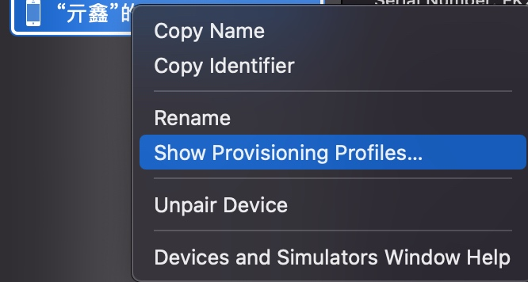
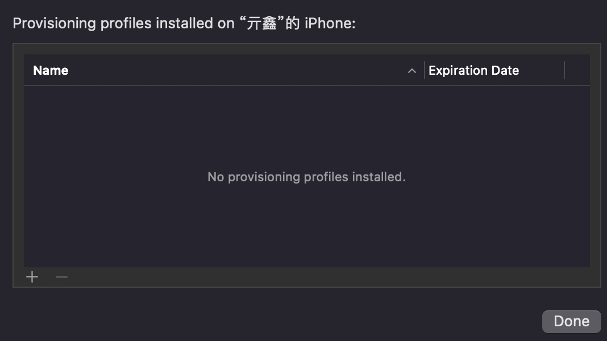

# The application could not be verified.

* iMac (11.7.6 (20G1231))
* Xcode (13.2.1 (13C100))
* iPhone6 plus  (9.0.2 - 越狱)


昨天还好好的真机run的,今天突然给我报了一个错误.
`The application could not be verified.`

```
Unable to install "xxxxxx"
Domain: com.apple.dt.MobileDeviceErrorDomain
Code: -402653126
User Info: {
    DVTErrorCreationDateKey = "2023-04-24 07:38:41 +0000";
    IDERunOperationFailingWorker = IDEInstalliPhoneLauncher;
}
--
The application could not be verified.
Domain: com.apple.dt.MobileDeviceErrorDomain
Code: -402653126
```

根据字面意思理解,感觉应该是和应用证书呀,描述文件呀,这些有关系,因为我得设备是越狱设备,更加的扑朔迷离了.

## 尝试1

重新安装描述文件

打开`Xcode菜单/Window/设备和模拟器`





删除之前的描述文件,然后重新添加一次.

> 但是我的手机似乎完全无法添加,不知道和越狱是否有关.
> 想一想,我得设备打个appSync补丁,按说应该可以跳过验证才对

失败!!

## 尝试2

调整Xcode证书相关配置

在 `Xcode / target / Build Settings / Singing / Code Signing Identity` 里,把原来的 `Apple Development` 改为 `Sign to Run locally`

原来的默认保持不变
`Code Signing Style = Automatic`
`Development Team = 你的`
`Provisioning Profile = Automatic`


成功!!!