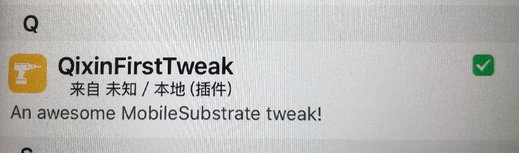

# Theos tweak hook 实践记录

[Theos官网](https://theos.dev/docs/)
[Theos github](https://github.com/theos/theos)

## Theos安装

* Xcode(appstore下载)

* Homebrew

```shell
/bin/bash -c "$(curl -fsSL https://raw.githubusercontent.com/Homebrew/install/HEAD/install.sh)"
```

* Theos

```shell
bash -c "$(curl -fsSL https://raw.githubusercontent.com/theos/theos/master/bin/install-theos)"
```

## 创建Theos插件

先创建一个文件夹
cd 到文件路径,执行以下命令

```shell
$THEOS/bin/nic.pl
```

会列出以下模版

```shell
NIC 2.0 - New Instance Creator
------------------------------
  [1.] iphone/activator_event
  [2.] iphone/activator_listener
  [3.] iphone/application
  [4.] iphone/application_swift
  [5.] iphone/control_center_module-11up
  [6.] iphone/cydget
  [7.] iphone/flipswitch_switch
  [8.] iphone/framework
  [9.] iphone/library
  [10.] iphone/notification_center_widget
  [11.] iphone/notification_center_widget-7up
  [12.] iphone/preference_bundle
  [13.] iphone/preference_bundle_swift
  [14.] iphone/theme
  [15.] iphone/tool
  [16.] iphone/tool_swift
  [17.] iphone/tweak
  [18.] iphone/tweak_with_simple_preferences
  [19.] iphone/xpc_service
  [20.] iphone/xpc_service_modern
```

然后会出现以下几个问题,需要你来填写

* Choose a Template (required): 17

> 模版请参考上面的列表

* Project Name (required): QixinFirstTWeak            

> 输入你的项目名

* Package Name [com.yourcompany.qixinfirsttweak]: com.qixin.firsttweak

> 你插件项目的包名

* Author/Maintainer Name [亓鑫]: 亓鑫  

> 作者名

* [iphone/tweak] MobileSubstrate Bundle filter [com.apple.springboard]: 

> 你要hook的程序的包名,不写的话,也可以在生成的项目中修改

* [iphone/tweak] List of applications to terminate upon installation (space-separated, '-' for none) [SpringBoard]: 

> 它指定了在安装tweak后需要终止的应用程序列表。


-------


然后会在你的目录中生成以下4个文件:

* Makefile

```Makefile
TARGET := iphone:clang:latest:7.0
INSTALL_TARGET_PROCESSES = SpringBoard


include $(THEOS)/makefiles/common.mk

TWEAK_NAME = QixinFirstTweak

QixinFirstTweak_FILES = Tweak.x
QixinFirstTweak_CFLAGS = -fobjc-arc

include $(THEOS_MAKE_PATH)/tweak.mk

# 需要增加一个UIKit依赖,因为测试demo中用到了UIKit
# 格式<项目名>_FRAMEWORKS
QixinFirstTweak_FRAMEWORKS = UIKit 
```

* Tweak.x

> hook代码

* QixinFirstTweak.plist

```plist
{ Filter = { Bundles = ( "com.qixin.myswiftproj" ); }; }
```
* control

```
Package: com.qixin.qixinfirsttweak
Name: QixinFirstTweak
Version: 0.0.1
Architecture: iphoneos-arm
Description: My first MobileSubstrate tweak!
Maintainer: qixin
Author: qixin
Section: Tweaks
Depends: mobilesubstrate (>= 0.9.5000)
```

## 编译

先cd到你的项目路径下

使用`make`编译

> 编译的文件在当前目录下的`.theos`文件夹下,该文件夹是隐藏文件,可以在Finder中使用`cmd+shift+.`来显示.

## 打包

使用`make package`打包deb

> 在你的目录下会创建"packages"目录,打包文件会放在这里

## 安装

使用`make install`安装到手机

install时可能会遇到如下问题:

```shell
==> Error: /Applications/Xcode.app/Contents/Developer/usr/bin/make install requires that you set THEOS_DEVICE_IP in your environment.
==> Notice: It is also recommended that you have public-key authentication set up for root over SSH, or you will be entering your password a lot.
make: *** [internal-install] Error 1
```

你需要设置THEOS_DEVICE_IP

```shell
# 设置你手机的ip
export THEOS_DEVICE_IP=192.168.x.xxx
```
> 在设置/无线局域网,点击"叹号",查看IP地址


安装完后因为配置中,默认会重启SpringBoard.(创建工程时设置)

```
==> Notice: It is also recommended that you have public-key authentication set up for root over SSH, or you will be entering your password a lot.
```

> 注意❗️❗️❗️❗️ `make install` 之前,需要先设置iPhone的SSH免密登录

[免密登录设置方式](https://github.com/qixin1106/DevelopmentNotes/blob/master/SSH免密登录iPhone(越狱)/README.md)

## 查看

打开Cydia/已安装,查看列表中,可以看到自己创建的插件




## 如何将资源文件一同打包进app

你需要再tweak项目文件夹中创建一个`layout`文件夹, 然后将你的资源copy到其中,`layout`中也可以创建不同的文件夹,总之,里面的目录结构会原封不动的copy到app根目录中.

## tweak安装原理

* 当你`make`时,首先会在`/.theos/`目录下生成`xxx.dylib`动态库
* 当你`make package` 会在/packages/目录下,生成xxx.deb插件安装包
* 当你`make install` 会在连接你的设备,来安装你的插件,安装的位置在`/Library/MoblieSubstrate/DynamicLibraries/`
* 分别是你的xxx.dylib和xxx.plist(就是tweak项目创建时生成那个plist,指定你要hook的appid那个)

## tweak运行原理

* 在Cydia中有一个插件`Cydia Substrate`
* 当你打开一个app时,它会在`/Library/MoblieSubstrate/DynamicLibraries/`中查找所有的plist,比对其中的appid和你打开的app的id是否一致,如果一致则,去加载对应的动态库.
* 动态库会对内存中的代码执行流程进行修改.当你原程序中调用了你hook的方法时,将会被调到动态库中的对应方法中.

## Tweak同时编写多个文件

* 首先你要创建一个新的.x文件或者创建objc class文件(.h+.m)也可以
* 修改Makefile文件中的配置, 增加你要编译的文件, 在我的项目中找到`QixinFirstTweak_FILES = Tweak.x`
* 将你要添加编译的文件增加到后面,使用`空格`分隔,比如:`QixinFirstTweak_FILES = Tweak.x other1.x other2.x other3.m`
