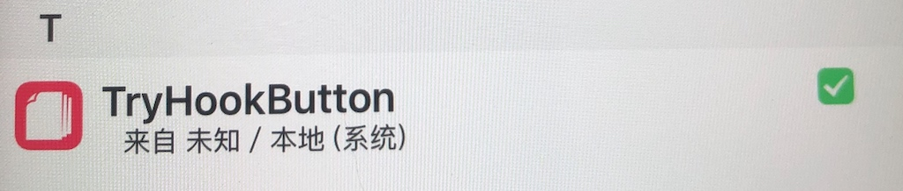

# iOSOpenDev工具Tweak实践

iOSOpenDev是一个开源项目，它可以设置iOS SDK以允许在Xcode中进行开放式开发，以构建不受默认支持或允许的越狱类型项目，并提供用于构建常见越狱类型项目和所需工具的Xcode模板。

设备:

* iMac (11.7.6 (20G1231))
* iPhone6 plus (9.0.2 越狱)

软件:
* Xcode (13.2.1 (13C100))
* iOSOpenDev (1.6-2)
* Theos (2.5)

## 安装

[iOSOpenDev官网下载](http://iosopendev.com/download/)

看到更新到1.6-2,但是是2013年的,目前已经10年没更新了,听说作者不写了.

直接安装的话会提示失败


可以去通过补丁来修复

[修复补丁](https://github.com/qixin1106/iOSOpenDev_Specifications)

## 创建一个demo项目

* 打开Xcode, `cmd+shift+n` 创建一个新项目,选择iOS平台


* 我们创建一个 `Logos Tweak` 项目


* xxx.xm文件

> 这个就是之前.x文件,是写hook逻辑代码的

* control

> 这个还是写一些描述信息的

* xxxxx.plist

> 这里面是写你要hook的程序的Bundle id列表的

## 添加动态库

* TARGETS > Build Phases > Link Binary With Libraries
* 添加/opt/iOSOpenDev/lib/libsubstrate.dylib

## 编译

#### 坑1
报错了!!至少我跪了.


> 这个错误是由于libsubstrate.dylib缺少armv7所需的架构而导致的。

```shell
Qixin@iMac ~ % lipo -info /opt/iOSOpenDev/lib/libsubstrate.dylib 
Architectures in the fat file: /opt/iOSOpenDev/lib/libsubstrate.dylib are: armv6 arm64 
```
于是我去看了下,还真是没有armv7架构,那么只能去删除Xcode项目架构列表了.


***解决:***

* Xcode中，`Build Settings/Architectures/Architectures` 只写一个`arm64`

或者

* Xcode中，`Build Settings/Architectures/Excluded Architectures` 加一个`armv7`


-------

#### 坑2

再次编译, 又报错!!


```
Failed to locate Logos Processor. Is Theos installed? If not, see http://iphonedevwiki.net/index.php/Theos/Getting_Started.
```
***修复办法:***

* 未安装Theos, 需要安装

* 已安装Theos, 检查/opt/theos是否存在

我确定我已经安装过了, 但是确实`opt/theos`下不存在,而是安装在了用户目录下`~/theos`

2个办法,要么你把theos复制一份到`opt/theos`,要么去`iosod`脚本中修改一下地址.我看`theos`有770MB,还挺大的,我还是修改脚本吧


> `iosod`脚本第28行,把`/opt/theos/`改为`~/theos/`

脚本修改如下所示:

```shell
# 原
export PATH=/opt/iOSOpenDev/bin:/opt/theos/bin:/usr/local/bin:/usr/bin:/usr/sbin:/bin:/sbin:$PATH

# 改
export PATH=/opt/iOSOpenDev/bin:~/theos/bin:/usr/local/bin:/usr/bin:/usr/sbin:/bin:/sbin:$PATH
```


> [Theos安装说明](https://github.com/qixin1106/DevelopmentNotes/blob/master/Theos插件Tweak基本使用/Theos_tweak_hook_实践记录.md) 请参考安装部分

-------

#### 配置证书

* Xcode中`Build Settings/Signing/Code Signing Identity`配置一下证书

-------

#### 配置iOSOpenDevDevice

*  Xcode中`Build Settings/User-Defined/iOSOpenDevDevice`写上`你iPhone局域网中的ip地址`
*  
-------


#### 坑3

又又又报错了.

```shell
The domain/default pair of (/Users/Qixin/Downloads/TryHookButton/TryHookButton/PackageVersion, Major) does not exist

Failed to read defaults property Major from /Users/Qixin/Downloads/TryHookButton/TryHookButton/PackageVersion.plist
```
创建项目时,好像少文件,我一看项目确实少plist


看意思是脚本运行时,报了个什么`Major`没有找到之类的,还是去打开`iosod`这个脚本,

搜索`Major`关键词,发现如下

```shell
function getVersionFromVersionPList() # args: plistPath
{
	$setCmd
	
	local plistPath="$1"
	local version
	local major
	local minor
	local bugFix
	local stage
	local pkgRev
	
	major=`readDefaultsValue "$plistPath" "Major"`
	minor=`readDefaultsValue "$plistPath" "Minor"`
	bugFix=`readDefaultsValue "$plistPath" "BugFix"`
	stage=`readDefaultsValue "$plistPath" "Stage"`
	pkgRev=`readDefaultsValue "$plistPath" "PackageRevision"`

	version="$major.$minor"
		
	[[ "$bugFix" == "" ]] || version+=".$bugFix"
	[[ "$stage" == "" ]] || version+="$stage"
	[[ "$pkgRev" == "" ]] || version+="-$pkgRev"
		
	# return #
	echo "$version"
}
```

> 看起来似乎是在解析这个plist文件,看起来大概是包含5个Key, 如果没有的话,那么只能自己创建一个plist了.

大坑,等我创建时,才发现原来工程中存在这个plist,只是导入的路径有点问题.从新加入工程即可.

此时再次`cmd+shift+i`,发现依然报错,这么说其实刚才是我误解,真正的问题不是没有导入plist,因为plist文件是真实存在于你的项目路径下的,而且脚本所读取的path是正确的.

那么问题更加的扑朔迷离了.

经过查阅资料:发现一个网友的笔记,介绍了同类问题

> [Mac OS 10.5 shell 使用defaults read读取文件显示does not exist](https://www.jianshu.com/p/a933e25a7c91)

简单来说就是macOS升级到10.15之后`defaults read` 读取大部分plist文件都会显示`does not exist`

而该作者感谢地[Ninja400]网友提供的方法确实可以解决该问题.

```shell
function readDefaultsValue() # args: plistPath, propertyName
{
    $setCmd
    
    local plistPath="$1"
    local propertyName="$2"
    local value

    value=`/usr/libexec/PlistBuddy -c "Print '$propertyName'" "$plistPath"` || \
        panic $? "Failed to read defaults property $propertyName from $plistPath"
      # 使用defaults read无法读取plist
    # value=`defaults read "${plistPath%.*}" "$propertyName"` || \
        # panic $? "Failed to read defaults property $propertyName from $plistPath"

    # return #
    echo "$value"
}
```

> 打开`iosod`文件, 找到readDefaultsValue()方法, 按以上内容修改


再次`cmd+shift+i`,成功,完美的折腾之后终于安装上自己的deb插件了.🎉




-------

### 为什么使用Build for Profiling而不是Build


这是因为在iOS上运行的应用程序和插件都必须经过代码签名和验证。在构建一个tweak插件时，它需要与其它应用程序和系统组件进行交互，而这些组件都是由苹果公司签名的。如果您直接使用Build选项构建tweak插件，则无法签名和验证该插件，因此它将无法在iOS上运行。

因此，您需要使用Build for Profiling选项构建tweak插件，这将创建一个可供调试和分析的版本。然后，您可以使用调试器将插件加载到iOS设备上，以便在运行时分析和调试插件。

-------

## Tweak写一个简单的hook

### Tweak项目中

TryHookButton.xm

```objc
// %hook [类名] : 标示要hook的类
%hook ViewController
// 你要hook的方法
- (void)onClickMyButton:(id)sender {
    // 自定义操作
    NSLog(@"Try --- Click me hooked !!");
    // theos的log输出
    %log;
    // 获取指向原始函数或方法的指针。
    // 如果不写则意味着被hook的方法,不会执行原本的操作
    %orig;
}
// 结尾
%end
```
### 被hook的项目中

ViewController.m

```objc
#import "ViewController.h"

@interface ViewController ()
@property (strong, nonatomic, nonnull) UIButton *button;
@end
@implementation ViewController
- (void)viewDidLoad {
    [super viewDidLoad];
    
    _button = [UIButton buttonWithType:UIButtonTypeRoundedRect];
    [_button setTitle:@"Click" forState:UIControlStateNormal];
    [_button addTarget:self action:@selector(onClickMyButton:) forControlEvents:UIControlEventTouchUpInside];
    [self.view addSubview:_button];
}
- (void)viewWillLayoutSubviews {
    [super viewWillLayoutSubviews];
    [_button setFrame:CGRectMake(100, 100, 100, 30)];
}
// 我们要hook的方法是这个.
- (void)onClickMyButton:(id)sender {
    const NSArray *colors = @[[UIColor redColor], [UIColor greenColor], [UIColor yellowColor]];
    int index = arc4random() % 3;
    self.view.backgroundColor = colors[index];
    NSLog(@"my proj click me");
}
@end
```

运行起来,目前我们是直接在Xcode中Run,所以直接可以在Xcode的控制台,看到log输出

```objc
// Tweak的自定义输出
2023-04-25 14:21:46.082 HookedDemo[2174:98730] Try --- Click me hooked !!
// Tweak自带的输出
2023-04-25 14:21:46.084 HookedDemo[2174:98730] -[<ViewController: 0x136d7cf60> onClickMyButton:<UIButton: 0x136e508c0; frame = (100 100; 100 30); opaque = NO; layer = <CALayer: 0x136e50d00>>]
// 被hook方法的输出
2023-04-25 14:21:46.085 HookedDemo[2174:98730] my proj click me
```
