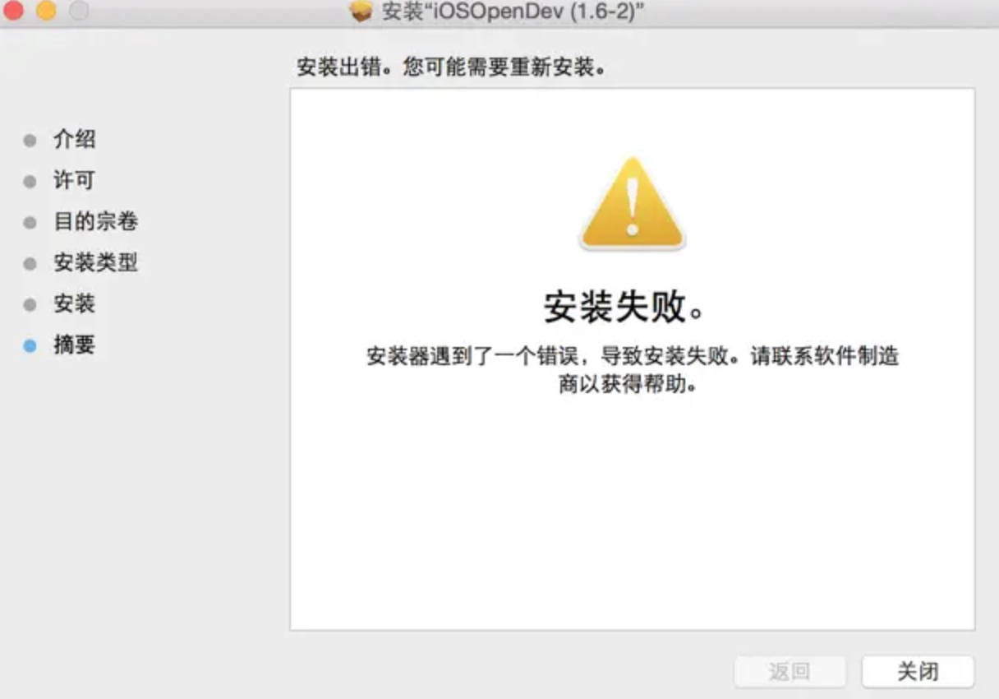
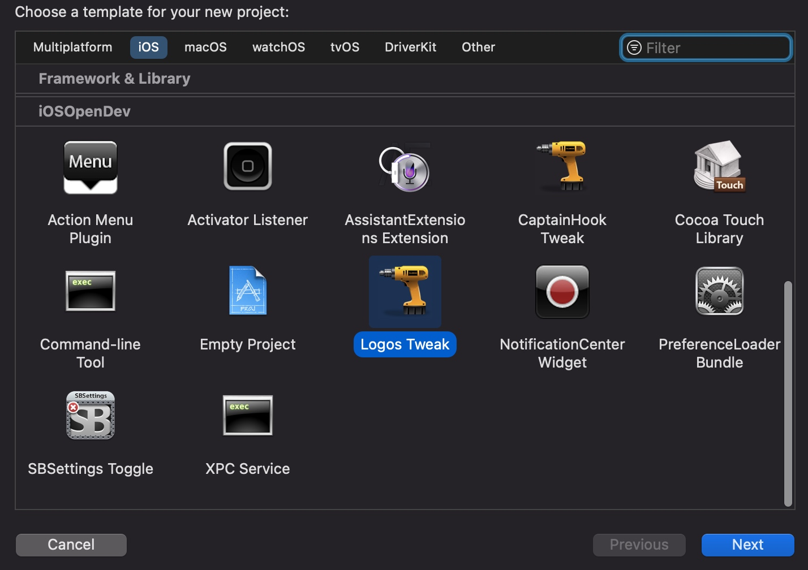
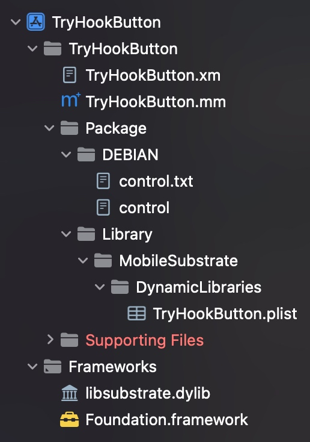
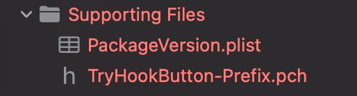

# iOSOpenDev工具Tweak实践

iOSOpenDev是一个开源项目，它可以设置iOS SDK以允许在Xcode中进行开放式开发，以构建不受默认支持或允许的越狱类型项目，并提供用于构建常见越狱类型项目和所需工具的Xcode模板。

## 安装

[iOSOpenDev官网下载](http://iosopendev.com/download/)

看到更新到1.6-2,但是是2013年的,目前已经10年没更新了,听说作者不写了.

直接安装的话会提示失败



可以去通过补丁来修复

[修复补丁](https://github.com/qixin1106/iOSOpenDev_Specifications)

## 创建一个demo项目

* 打开Xcode, `cmd+shift+n` 创建一个新项目,选择iOS平台



* 我们创建一个 `Logos Tweak` 项目



* xxx.xm文件

> 这个就是之前.x文件,是写hook逻辑代码的

* control

> 这个还是写一些描述信息的

* xxxxx.plist

> 这里面是写你要hook的程序的Bundle id列表的

## 添加动态库

* TARGETS > Build Phases > Link Binary With Libraries
* 添加/opt/iOSOpenDev/lib/libsubstrate.dylib

## 编译

#### 坑1
报错了!!至少我跪了.


> 这个错误是由于libsubstrate.dylib缺少armv7所需的架构而导致的。

```shell
Qixin@iMac ~ % lipo -info /opt/iOSOpenDev/lib/libsubstrate.dylib 
Architectures in the fat file: /opt/iOSOpenDev/lib/libsubstrate.dylib are: armv6 arm64 
```
于是我去看了下,还真是没有armv7架构,那么只能去删除Xcode项目架构列表了.


Xcode中，`Build Settings/Architectures/Architectures` 只写一个`arm64`

或者

Xcode中，`Build Settings/Architectures/Excluded Architectures` 加一个`armv7`


-------

#### 坑2

再次编译, 又报错!!


```
Failed to locate Logos Processor. Is Theos installed? If not, see http://iphonedevwiki.net/index.php/Theos/Getting_Started.
```
***修复办法:***

* 未安装Theos, 需要安装

* 已安装Theos, 检查/opt/theos是否存在

我确定我已经安装过了, 但是确实`opt/theos`下不存在,而是安装在了用户目录下`~/theos`

2个办法,要么你把theos复制一份到`opt/theos`,要么去`iosod`脚本中修改一下地址.我看`theos`有770MB,还挺大的,我还是修改脚本吧


`iosod`脚本第28行,把`/opt/theos/`改为`~/theos/`
```shell
# 原
export PATH=/opt/iOSOpenDev/bin:/opt/theos/bin:/usr/local/bin:/usr/bin:/usr/sbin:/bin:/sbin:$PATH

# 改
export PATH=/opt/iOSOpenDev/bin:~/theos/bin:/usr/local/bin:/usr/bin:/usr/sbin:/bin:/sbin:$PATH
```


> [安装说明](https://github.com/qixin1106/DevelopmentNotes/blob/master/Theos插件Tweak基本使用/Theos_tweak_hook_实践记录.md) 请参考安装部分

-------

#### 配置证书

* Xcode中`Build Settings/Signing/Code Signing Identity`配置一下证书

#### 配置iOSOpenDevDevice

*  Xcode中`Build Settings/User-Defined/iOSOpenDevDevice`写上`你iPhone局域网中的ip地址`

#### 坑3

又又又报错了.

```shell
The domain/default pair of (/Users/Qixin/Downloads/TryHookButton/TryHookButton/PackageVersion, Major) does not exist

Failed to read defaults property Major from /Users/Qixin/Downloads/TryHookButton/TryHookButton/PackageVersion.plist
```
创建项目时,好像少文件,我一看项目确实少plist




