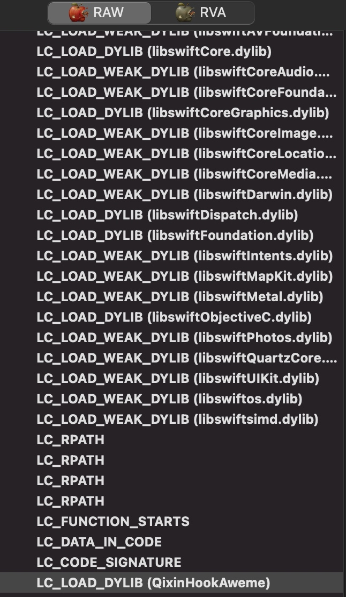

# yololib代码注入实践

[yololib](https://github.com/KJCracks/yololib) github

yololib是一个注入动态链接库的工具，可以给mach-o文件注入framework。yololib可以使用machOView软件查看注入的framework。

### 使用方式

* 从[github下载](https://github.com/KJCracks/yololib)项目
* 编译得到yololib可执行文件
* 将yololib复制到/usr/local/bin
* 然后执行 `yololib` `binary` `dylib file`

> 第一个参数为被注入app的mach-o文件，第二个参数为你的framework可执行文件。

