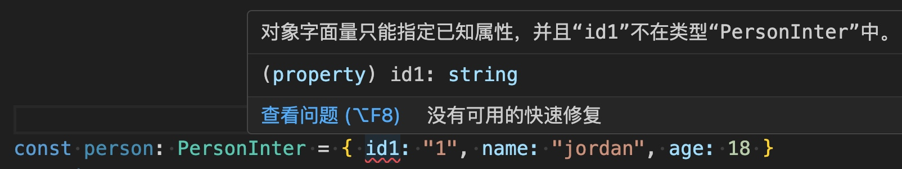

# interface & implements

在 TypeScript 中，interface 可以定义对象的属性和方法，而且实现了这个 interface 的对象必须去实现 interface 中的属性或者方法。

## 基本使用

```ts
// 定义一个Person的接口
export interface PersonInter {
    id: string,
    name: string,
    age: number,
    sayHello: () => void,
}
```
```ts
// 在该实现`PersonInter`的`Jordan`类中,我们必须要实现其提供的属性和方法.

import { type PersonInter } from './xxxxx';

class Jordan implements PersonInter {
    id: string;
    name: string;
    age: number;
    constructor(id: string, name: string, age: number) {
        this.id = id
        this.name = name
        this.age = age
    }
    sayHello() {
        console.log("Hello");
    }
}
```
 interface中也可以定义一些非强制属性和方法,如下:
 
```ts
// 定义一个
export interface PersonInter {
    id: string,
    name: string,
    age: number,
    sayHello: () => void,
    // 可选类型, 实现类不需要强制实现
    job?: string,
    address?: string,
    phoneNo?: string,
    sayFuck?: () => void,
}
```

```ts
import { type PersonInter } from './xxxxx';

class Jordan implements PersonInter {
    id: string;
    name: string;
    age: number;
    constructor(id: string, name: string, age: number) {
        this.id = id
        this.name = name
        this.age = age
    }
    sayHello() {
        console.log("Hello");
    }
}
```

## 用来做为类型约束

```ts
// 定义一个
export interface PersonInter {
    id: string,
    name: string,
    age: number,
}
```

将 `person` 对象进行 `PersonInter` 形状约束

```ts
import { type PersonInter } from './xxxxx';

const person: PersonInter = { id: "1", name: "jordan", age: 18 }
```
此时如果对象的属性,严格按照`PersonInter`的定义来检查,一旦缺少属性,或者增多属性,都会开发时报错.



## 约束集合类型

下面我有一个列表数据,其中每一个对象都是一个约束的`PersonInter`类型的.

```ts
let personlist: Array<PersonInter> = [
    { id: "1", name: 'jordan', age: 18 },
    { id: "2", name: 'kebo', age: 19 },
    { id: "3", name: 'jackson', age: 20 },
]
```

## 给自定义类型起一个别名 type

上面我们使用`Array<PersonInter>`来定义数组的类型约束,也可以给它起一个别名,利用`type`
如下:
```ts
export type Persons = PersonInter[]
```

```ts
import { type Persons } from './xxxxx';
let list: Persons = [
    { id: "1", name: 'jordan', age: 18 },
    { id: "2", name: 'kebo', age: 19 },
    { id: "3", name: 'jackson', age: 20 },
]
```