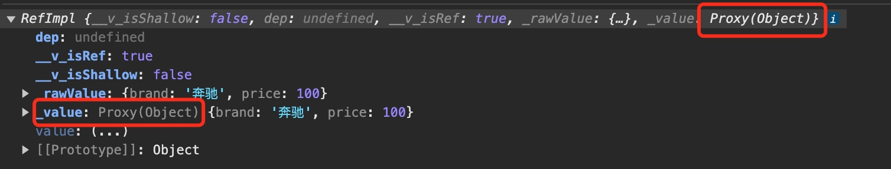

# Vue的响应式数据配置

## ref

让基本类型数据具有响应式效果, 被 `ref` 包裹的对象是 `RefImpl` 类型




```json
{
    "__v_isShallow": false,
    "__v_isRef": true,
    "_rawValue": {
        "brand": "奔驰",
        "price": 100
    },
    "_value": {
        "brand": "奔驰",
        "price": 100
    }
}
```

 

```html
// UI
<template>
    <div class="person">
        <h2>姓名: {{ name }}</h2>
        <h2>年龄: {{ age }}</h2>
        <h2>地址: {{ address }}</h2>
        <button @click="changeName">修改名字</button>
        <button @click="changeAge">修改年龄</button>
        <button @click="showTel">查看联系方式</button>
    </div>
</template>

// 逻辑
<script lang="ts" setup name="Person">
    // 导入ref,使用ref包裹的变量具有响应式效果.
    // 
    import { ref } from "vue";
    
    // 数据     
    let name = ref("亓鑫")
    let age = ref(19)
    let tel = "123456789"
    let address = "沙河"
    
    // 方法
    function changeName() {
        name.value = "fuck"
    }
    function changeAge() {
        age.value += 1
    }
    function showTel() {
        alert(tel)
    }
</script>

// 样式
<style scoped>
.person {
    background-color: skyblue;
    box-shadow: 0 0 10px;
    border-radius: 10px;
    padding: 20px;
}
</style>
```

也可以定义对象类型


```html
<template>
    <div class="person">
        <h2>一辆{{ car.brand }}车, 价值{{ car.price }}万</h2>
        <button @click="changePrice">修改汽车价格</button>
        <br>
        <ul>
            <li v-for=" item in games" :key="item.id">{{ item.name }}</li>
        </ul>
        <button @click="changeFirstName">修改第一个游戏名字</button>
    </div>
</template>


<script lang="ts" setup name="Person">

    import { ref } from "vue";
    
    // 数据     
    let car = ref({brand: "奔驰", price: 100})
    let games = ref([
        {id: "1", name: "王者"},
        {id: "2", name: "原神"},
        {id: "3", name: "LOL"},
    ])
    function changePrice() {
        car.value.price += 10
    }
    function changeFirstName() {
        games.value[0].name = "CS"
    }
</script>

<style scoped>
.person {
    background-color: skyblue;
    box-shadow: 0 0 10px;
    border-radius: 10px;
    padding: 20px;
}
</style>
```

## reactive

让对象具有响应式效果,被`reactive`包裹的对象,实际是`Proxy(Object)类型`

> 只能定义对象


```html
<template>
    <div class="person">
        <h2>一辆{{ car.brand }}车, 价值{{ car.price }}万</h2>
        <button @click="changePrice">修改汽车价格</button>
    </div>
</template>


<script lang="ts" setup name="Person">
    // 导入reactive
    import { reactive } from "vue";
    
    // 数据     
    let car = reactive({brand: "奔驰", price: 100})
    // 方法
    function changePrice() {
        car.price += 10
    }
</script>

<style scoped>
.person {
    background-color: skyblue;
    box-shadow: 0 0 10px;
    border-radius: 10px;
    padding: 20px;
}
</style>
```

## 区别

* `ref` 创建的对象必须使用 `.value` 
* `reactive` 重新分配一个新对象,会**失去**响应式

例子:(会**失去**响应式)
```js
function changeCar() {
    // 这么写不行
    // car = reactive({ brand: "特斯拉", price: 30 })
    // 这样写才行
    Object.assign(car, { brand: "特斯拉", price: 30 })
}
```

如果是`ref`包裹的`car`,则可以直接修改
```js
    // 如果是ref包裹的car对象,则可以这样写
    car.value = { brand: "特斯拉", price: 30 }
```


## 使用原则

1. 若需要一个基本类型的响应式数据,只能使用`ref`
2. 若需要一个响应式对象,层级不深,`ref`和`reactive`都可以
3. 若需要一个响应式对象,且层级较深,推荐使用`reactive`