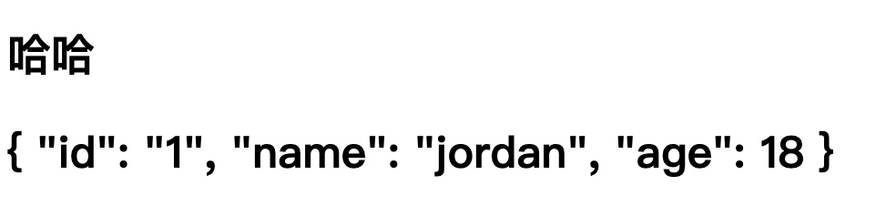
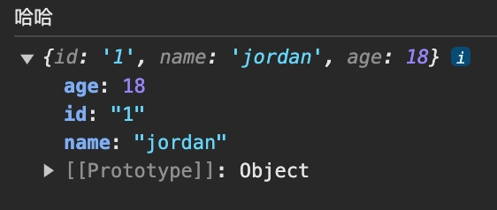

# 组件间传值 defineProps

### A.vue

```html
<template>
    <!-- 这里a和b都是传入的值 -->
    <!-- 传入对象时需要用:方式,绑定对象,否则传入的是字符串 -->
    <Person a="哈哈" :b="person"/>
</template>

<script lang="ts" setup name="App">
    import Person from './components/Person.vue'
    let person = {id: "1", name: "jordan", age: 18}
</script>

<style scoped>
</style>
```

### Person.vue

```html
<template>
    <div class="person">
        <h2>{{ a }}</h2>
        <h2>{{ b }}</h2>
    </div>
</template>

<script lang="ts" setup name="Person">
    import { defineProps } from "vue";
    // 这里属性名要和传入的名字一致,否则无法读取到,返回undefined
    // 返回值"props"是一个对象,包含你所写入的["a","b"]变量
    let props = defineProps(["a", "b"])
    console.log(props.a);
    console.log(props.b);
</script>

<style scoped>
</style>
```

> 
> 

### 将person变为一个响应式对象

之前传入Person的绑定的对象只是一个普通对象,这样在我对象修改时,并不会反馈到UI上.这是需要传入一个响应式对象

```ts
import { reactive } from "vue"
let person = reactive({id: "1", name: "jordan", age: 18})
```

### 限制传参类型+如何给定默认值withDefaults

```ts
import { defineProps, withDefaults } from "vue";
import { type Persons } from "./xxxxx";

// list是外部传入的一个变量
// list是Persons类型的数组(Persons是一个自定义数组类型)

// 只接受list
defineProps(["list"])

// 接受list + 限制类型
defineProps<{list: Persons}>()

// 接受list + 限制类型 + 限制必要性 + 指定默认值
// list? :Person为必要性
withDefaults(defineProps<{ list?: Persons }>(), {
    list: () => [{ id: '1', name: "jordan", age: 18 }]
})
// 或
withDefaults(defineProps<{ list?: Persons }>(), {
    list: function() {
        return [{ id: '1', name: "jordan", age: 18 }]
    } 
})
```