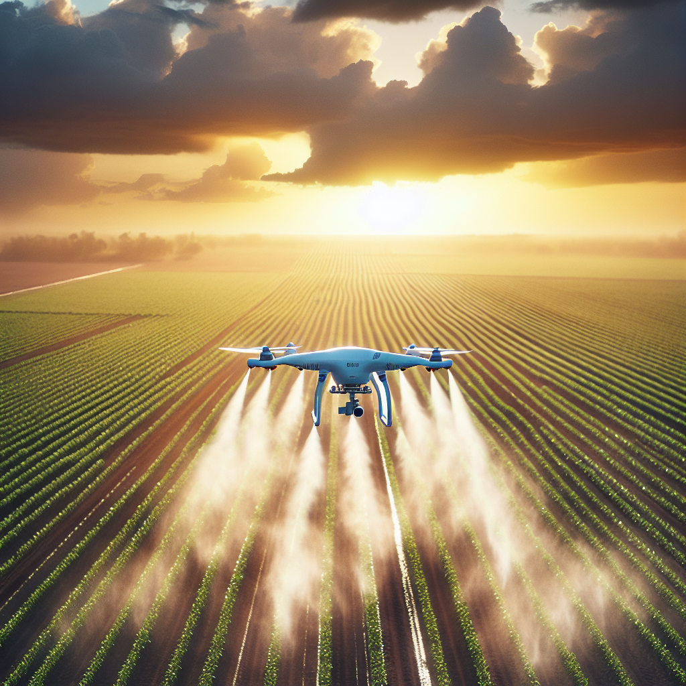
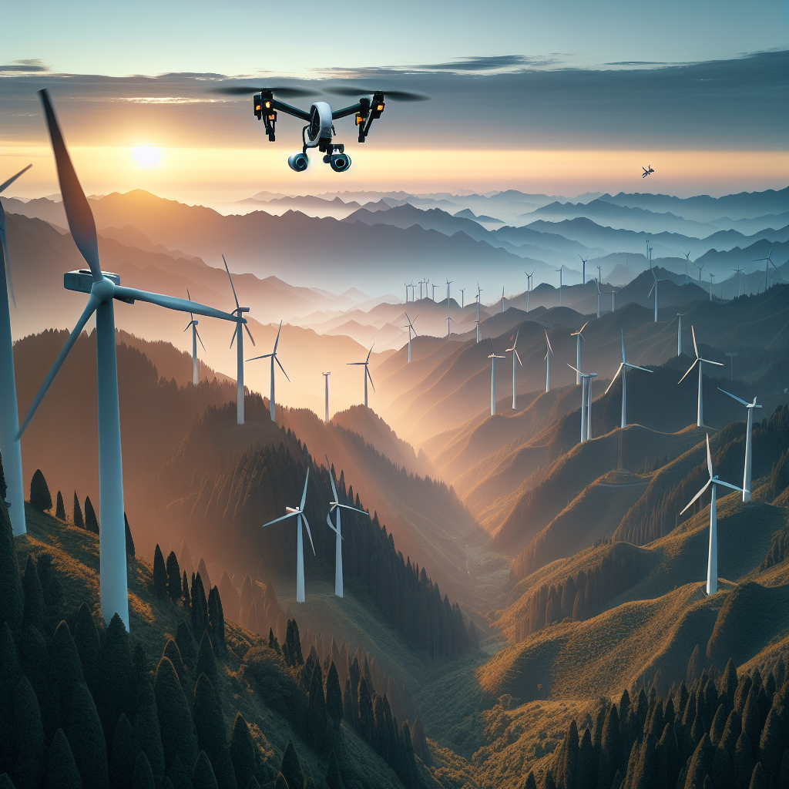
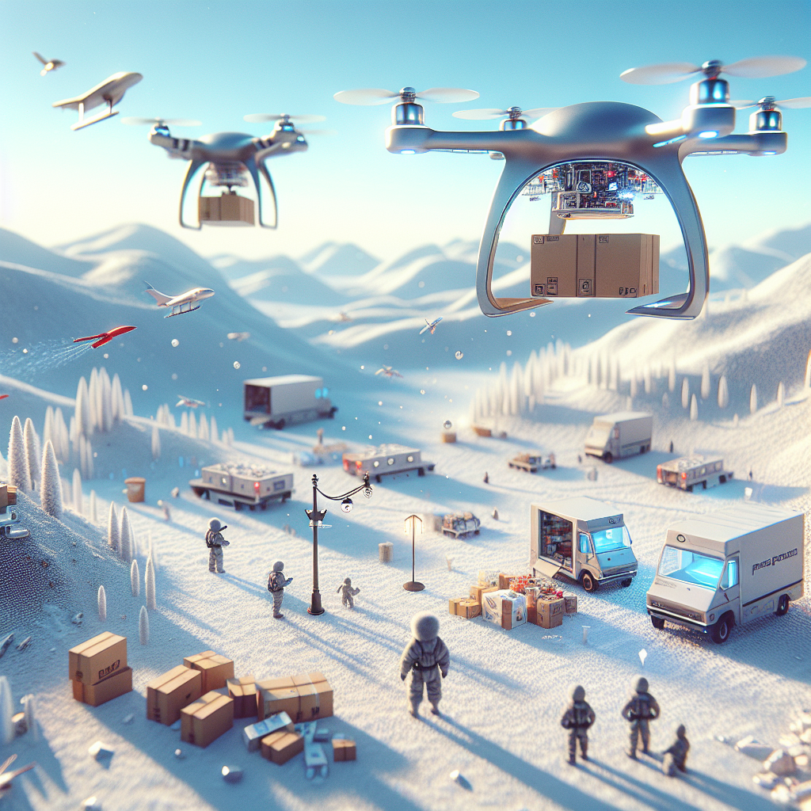
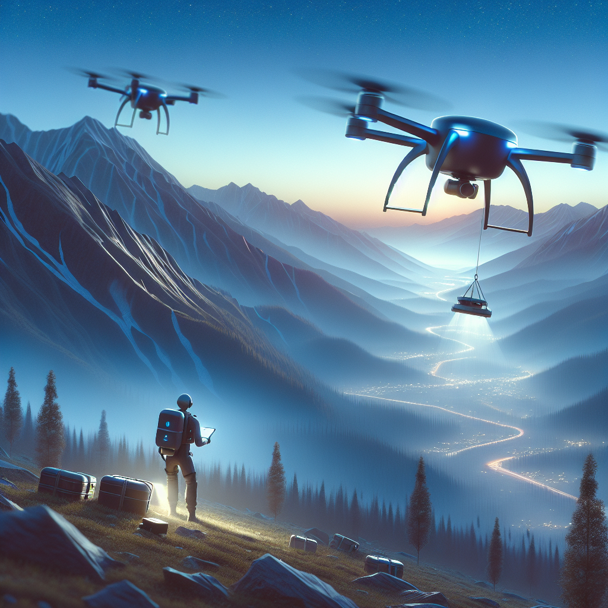
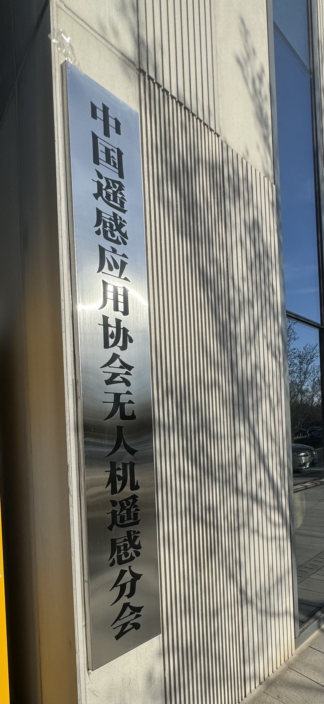

# 工业无人机：科技的力量，改变工作方式

Across the vast expanse of China, industrial drones soar like eagles, weaving through the steel forests of cities and the golden fields of the countryside. They are not only the crystallization of technology, but also the sharp tools in the hands of the industrious and wise Chinese people, helping various industries move towards greater efficiency and lower costs.

Imagine, in the scorching summer heat, vast fields of rice await the nourishment of pesticides. Traditional spraying methods are time-consuming and labor-intensive, and the results are often uncertain. At this moment, our industrial drones are like heavenly warriors, hovering lightly above the fields, precisely spraying pesticides onto each rice seedling. This not only greatly improves the efficiency of spraying, but also ensures the even distribution of pesticides, thereby increasing crop yields and quality. For farmers, this means higher income and a better life.

Now imagine, in remote mountainous areas, wind turbines stand atop peaks, awaiting the arrival of inspection personnel. The rugged mountain paths and inconvenient transportation make each inspection a great test of the inspectors' physical strength and endurance. However, with our industrial drones, everything becomes much simpler. They can easily fly to the top of the mountains, conducting a comprehensive inspection of the wind turbines, promptly identifying and reporting any potential faults. This not only greatly reduces the workload of inspectors, but also ensures the stable operation of the turbines, providing a continuous supply of clean energy to society.

These are our industrial drones, playing important roles in various fields such as agriculture, energy, transportation, and environmental protection. With the power of technology, they have transformed traditional working methods, increased work efficiency, reduced operating costs, and created more value for society.

We believe that in the coming days, as technology continues to advance and innovate, our industrial drones will unlock greater potential, bringing tangible benefits to more people. Let us move forward together, embracing this new era full of infinite possibilities!

