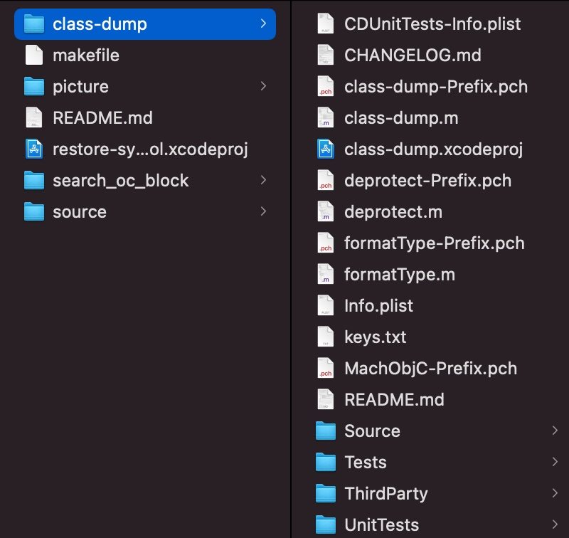
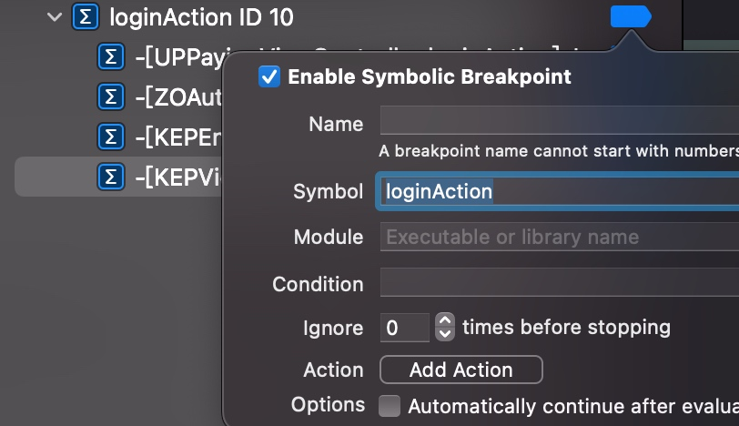
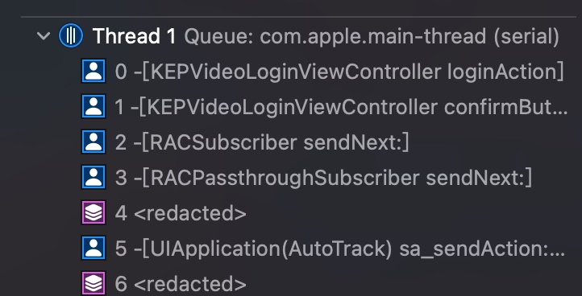

# 恢复符号表restore-symbol


[工具git下载](https://github.com/tobefuturer/restore-symbol)

## 编译

下载项目之后, 如果发现Class-dump文件夹为空,还需要下载该项目

[Class-dump下载](https://github.com/0xced/class-dump/tree/a8877b6695f317816322134944a410de09da4911)



完成之后打开`restore-symbol.xcodeproj`

开始编译, `cmd+b`

成功后,将编译的可执行文件,保存到 `/usr/local/bin` 中.

## 使用

#### 执行命令

`restore-symbol 原始文件路径 -o 导出文件路径`


#### 注意一次只能恢复一个架构

Restore-symbol supports armv7 and arm64 archtecture, but not support fat file. Please use lipo to thin the image file first.

```objc
if ([ofile isKindOfClass:[CDFatFile class]] ) {
    fprintf(stderr,"Restore-symbol supports armv7 and arm64 archtecture, but not support fat file. Please use lipo to thin the image file first.");
    exit(1);
}
```


* 你需要检查你的mach-o文件架构,通过以下命令

`lipo -info 你的mach-o路径`

> xxxxx is architecture: arm64 armv7

* 如上所示,如果你的mach-o文件是多架构的,则需要瘦身,通过以下命令

`lipo -thin 架构名(如arm64) -output 保存路径`


## 导出恢复Block的方法

* 打开ida软件, `File / Script file...` 

* 选择restore-symbol项目文件夹中的 `search_oc_block` 文件夹中的 `ida_search_block.py`

* 最终会在当前目录下生成 `block_symbol.json` 文件.

#### 开始恢复

* cd 到你的mach-o路径下

* 执行 `restore-symbol Keep -o Keep_block -j block_symbol.json`

* 提示如下则成功 

```shell
=========== Start =============
Scan OC method in mach-o-file.
Scan OC method finish.
Parse symbols in json file.
Parse finish.
=========== Finish ============
```

#### 将恢复的mach-o文件覆盖到原app中, 重签名

* 然后需要重新签名, 我使用的是[ios-app-signer](https://github.com/DanTheMan827/ios-app-signer)

* 关于使用方式可以参考我之前[笔记](https://github.com/qixin1106/DevelopmentNotes/tree/master/iOS砸壳实践) 重签名部分介绍


#### 恢复符号之后断点效果

可以用过方法名来断点了,比较方便.

在没有恢复符号之前是无法用方法名断住的, 需要运行时, 使用`基地址+方法地址` 来断点, 不太人性化.





