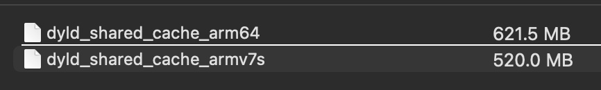
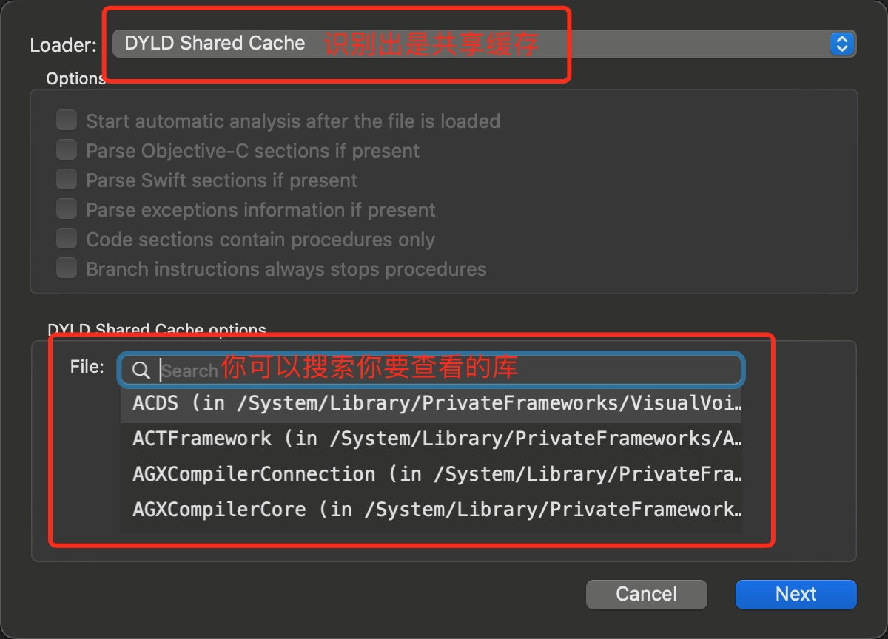
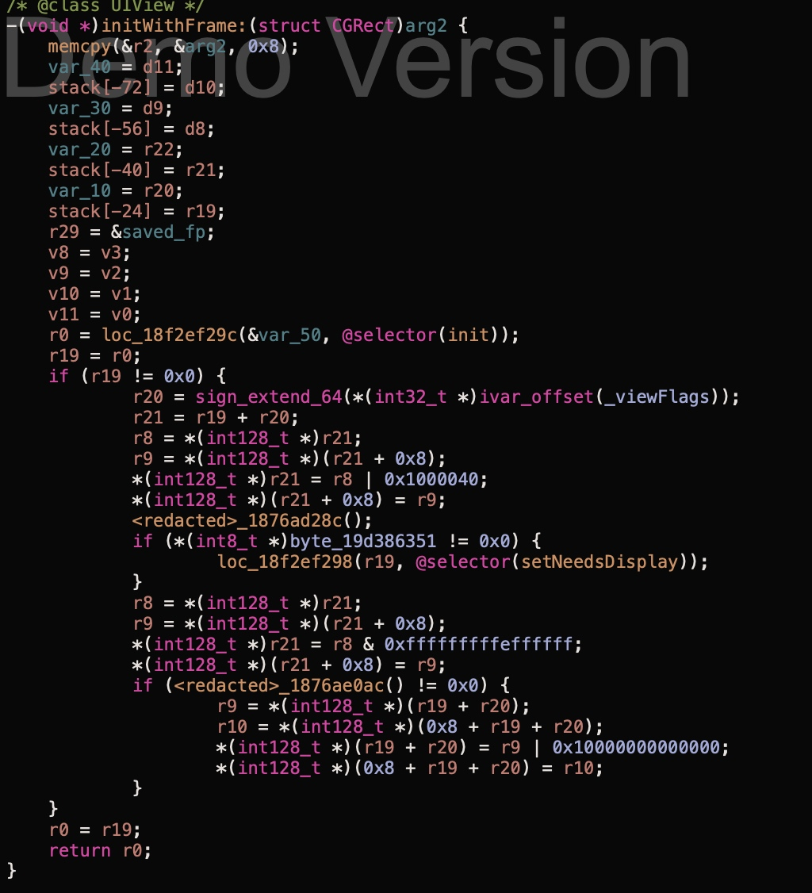

# 导出系统库Mach-o

想研究`系统库`的具体实现逻辑, 那么我们可以通过hopper等工具,反汇编查看系统库的mach-o文件.

**那么系统库的mach-o文件有在哪里找呢?**

通过iFunBox查看手机设备 `/System/Library/Framework/` 

我们看到,这个目录中存在许多系统库

但是我们打开之后,却看不到mach-o文件,里面似乎都是资源文件.

那么mach-o存放的位置更加扑朔迷离了.

### 动态库共享缓存(dyld shared cache)

> iOS中的动态库共享缓存（dyld shared cache）技术是一种优化技术，它旨在提高应用程序启动的速度和性能。动态库是可重用的代码库，可以在多个应用程序之间共享。在iOS中，系统会将所有可执行文件和动态库的二进制文件打包在一起，形成一个共享缓存文件，也就是dyld shared cache文件。

> 当一个应用程序需要加载一个动态库时，系统会先检查共享缓存文件中是否已经存在该动态库的二进制代码。如果存在，系统会直接从共享缓存文件中加载该动态库，从而避免了重新加载和链接的时间和开销。这种技术可以显著减少应用程序启动的时间，并提高系统性能。

> 值得注意的是，iOS系统会根据设备类型和系统版本生成不同的共享缓存文件。这是因为不同的设备和系统版本使用的动态库可能不同，因此需要针对不同的设备和系统版本生成不同的共享缓存文件。

它存放的位置在 `/System/Library/Caches/com.apple.dyld/`

### 为什么要合并成一个文件

> dyld shared cache是一种优化技术，它的目的是将已经编译好的动态链接库（dylib）合并到一个文件中，以便在运行时快速加载这些库，从而提高应用程序的启动速度和性能。

> 将动态链接库合并到一个文件中的好处是可以减少启动时加载的时间，因为当一个应用程序需要加载多个动态链接库时，每一个库都需要磁盘I/O操作，这些操作会降低应用程序的启动速度。而将这些库合并到一个文件中后，只需要一次I/O操作即可完成所有库的加载，从而减少了启动时间。

> 此外，将动态链接库合并到一个文件中还可以减少内存占用，因为每个动态链接库都需要占用一定的内存空间，当有多个应用程序同时运行时，这些库会被多次加载，从而占用更多的内存空间。而将这些库合并到一个文件中后，可以避免重复加载，从而减少内存占用。

### 通过hopper查看

* 我们将`dyld_shared_cache_arm64`文件copy到我的电脑中.

* 然后打开`hopper.app`

* 将刚copy过来的文件拖到`hopper`中.

* 

* 我们选择查看`UIKit.framework` , 注意是选择`framework`

* 

通过上面的提示, 我们可以查看伪代码(可读性更高)

我们发现`UIView`的`init`方法实际是调用了`initWithFrame:`

我们通过双击`initWithFrame:` 可以跳转到该方法的实现中

这里和Xcode中操作类似, 如果发现多个同名的方法,会咨询你是要查看哪个类的方法, 我们选择`UIView`的

可能很多内容看不明白,但是也能根据它大概看到一个流程.

