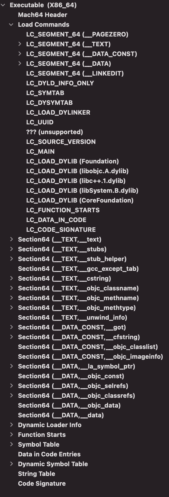
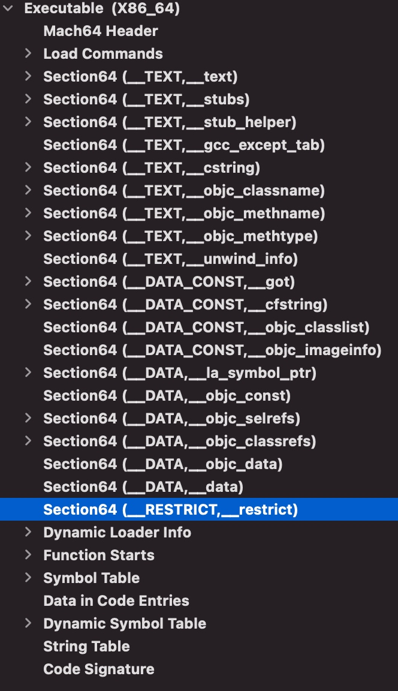

# 防止Cydia插件

[dyld库下载](https://github.com/apple-oss-distributions/dyld) 我是从tag中找到dyld-dyld-551.4


## 防插件方案

### 添加__RESTRICT段和__restrict节

* 打开Build Settings / Other Linker Flags 增加 `-Wl,-sectcreate,__RESTRICT,__restrict,/dev/null`

* 没有添加之前



* 添加之后



## DYLD_INSERT_LIBRARIES

DYLD_INSERT_LIBRARIES是一个macOS下的环境变量，它可以用来加载指定的动态链接库（dylib）到进程的地址空间中。

当一个可执行文件被启动时，系统会自动加载它所依赖的库，而DYLD_INSERT_LIBRARIES则可以在这个过程中注入一个额外的动态链接库，使得程序在运行时可以使用注入的库中的函数或者修改库中的全局变量等。

## 源码分析

```c
// src/dyld.cpp line 5928
// load any inserted libraries
if	( sEnv.DYLD_INSERT_LIBRARIES != NULL ) {
    for (const char* const* lib = sEnv.DYLD_INSERT_LIBRARIES; *lib != NULL; ++lib) 
        loadInsertedDylib(*lib);
}
```
这段代码的作用是检查环境变量DYLD_INSERT_LIBRARIES是否被设置，如果被设置了，则会加载所设置的动态链接库。


在这段代码之前，存在一个判断逻辑，如下:

```c
// src/dyld.cpp line 5712
#if __MAC_OS_X_VERSION_MIN_REQUIRED
    if ( gLinkContext.processIsRestricted ) {
		pruneEnvironmentVariables(envp, &apple);
		// set again because envp and apple may have changed or moved
		setContext(mainExecutableMH, argc, argv, envp, apple);
	}
	else
#endif
	{
		checkEnvironmentVariables(envp);
		defaultUninitializedFallbackPaths(envp);
	}
```

首先，代码检查gLinkContext.processIsRestricted是否为true，如果是，则调用pruneEnvironmentVariables函数来删除一些环境变量，以确保进程的环境变量不包含任何敏感信息或者恶意代码。然后，代码调用setContext函数来重新设置dyld的上下文环境，以便在进程加载动态链接库时使用新的环境变量和路径等信息。

如果gLinkContext.processIsRestricted不为true，则说明进程没有被限制特权，因此代码会调用checkEnvironmentVariables函数来检查环境变量是否合法，并调用defaultUninitializedFallbackPaths函数来设置一些默认的路径信息。这些路径信息用于在进程加载动态链接库时查找依赖的库。

那么我们来看下什么时候`gLinkContext.processIsRestricted = true`呢?
```c
// src/dyld.cpp line 4702
// any processes with setuid or setgid bit set or with __RESTRICT segment is restricted
if ( issetugid() || hasRestrictedSegment(mainExecutableMH) ) {
    gLinkContext.processIsRestricted = true;
}
```

### issetugid()

在dyld.cpp代码中，issetugid()是一个用于检查进程是否设置了setuid或setgid位的函数。

它是一个POSIX函数，可以在unistd.h头文件中找到它的声明。在macOS中，这个函数的实现是通过调用geteuid()和getuid()函数来比较进程的有效用户ID和实际用户ID是否相等，如果不相等，则说明进程设置了setuid或setgid位。

setuid或setgid是一种用于提升程序特权的机制，它允许程序在执行时临时拥有更高的权限，比如以root用户的身份运行。

这个机制在系统管理、安全性等方面都有着广泛的应用。

在上面的代码中，issetugid()函数被用来检查进程是否设置了setuid或setgid位，如果设置了，则说明进程拥有特权，因此需要受到限制。

这个限制通常涉及到加载动态链接库的安全性问题，以防止恶意程序通过注入动态库来提升特权或者执行其他危险操作。

### hasRestrictedSegment(mainExecutableMH)

```c
// src/dyld.cpp line 4295
//
// Look for a special segment in the mach header. 
// Its presences means that the binary wants to have DYLD ignore
// DYLD_ environment variables.
//
#if __MAC_OS_X_VERSION_MIN_REQUIRED
static bool hasRestrictedSegment(const macho_header* mh)
{
	const uint32_t cmd_count = mh->ncmds;
	const struct load_command* const cmds = (struct load_command*)(((char*)mh)+sizeof(macho_header));
	const struct load_command* cmd = cmds;
	for (uint32_t i = 0; i < cmd_count; ++i) {
		switch (cmd->cmd) {
			case LC_SEGMENT_COMMAND:
			{
				const struct macho_segment_command* seg = (struct macho_segment_command*)cmd;
				
				//dyld::log("seg name: %s\n", seg->segname);
				if (strcmp(seg->segname, "__RESTRICT") == 0) {
					const struct macho_section* const sectionsStart = (struct macho_section*)((char*)seg + sizeof(struct macho_segment_command));
					const struct macho_section* const sectionsEnd = &sectionsStart[seg->nsects];
					for (const struct macho_section* sect=sectionsStart; sect < sectionsEnd; ++sect) {
						if (strcmp(sect->sectname, "__restrict") == 0) 
							return true;
					}
				}
			}
			break;
		}
		cmd = (const struct load_command*)(((char*)cmd)+cmd->cmdsize);
	}
		
	return false;
}
#endif
```

在dyld.cpp代码中，hasRestrictedSegment(mainExecutableMH)这段代码的作用是检查给定的可执行文件是否包含名为__RESTRICT的segment。

如果可执行文件包含__RESTRICT segment，则说明进程被限制了一些操作。

__RESTRICT segment是一个macOS平台特有的segment，它可以用来限制进程的某些操作，比如禁止进程加载动态链接库或者执行某些系统调用。

通常情况下，__RESTRICT segment会被用于限制一些安全性较高的进程，比如Safari浏览器。

在上面的代码中，hasRestrictedSegment(mainExecutableMH)函数被用来检查给定的可执行文件是否包含__RESTRICT segment，如果包含，则说明进程被限制了一些操作，因此需要受到限制。

这个限制通常涉及到加载动态链接库的安全性问题，以防止恶意程序通过注入动态库来提升特权或者执行其他危险操作。


